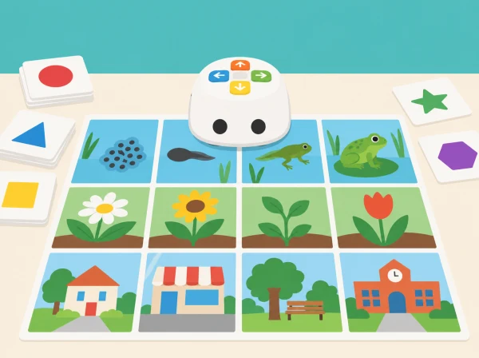

_Mapes i targetes elaborats a classe connecten la programació amb l’entorn pròxim i les ciències._

## 🌱 Punt de partida

La classe crea un mapa d’exploració del municipi: jardí, mercat, escola, plaça i espai d’aigua. En quinze reptes curts, Tale-Bot ajuda a ordenar idees, comparar rutes, descriure patrons i crear composicions. Les consignes parteixen de les 15 activitats oficials de categoria B, amb contingut local revisable i sense exigir mapes addicionals de la caixa comercial.

## 🗺️ Seqüència · 15 activitats d’exploració

### **B-1 · Els cinc sentits.**

#### Fase 1 · Activem i prediem

Trieu una targeta sensorial i relacioneu-la amb una imatge o un objecte del mapa. Expliqueu quin indici us ha fet triar-lo.

#### Fase 2 · Explorem i construïm

Dibuixeu dos recorreguts possibles fins a la mateixa destinació i representeu les ordres amb targetes abans de programar Tale-Bot.

#### Fase 3 · Expliquem i registrem

Compareu quantes ordres necessita cada ruta i marqueu-les amb colors diferents. Anoteu si les dues arriben a la mateixa casella.

#### Fase 4 · Apliquem i millorem

Programeu una de les rutes i comproveu-la sobre el mapa. Si no arriba a la destinació, localitzeu la primera ordre que cal canviar.

#### Fase 5 · Comprovem i reflexionem

**Evidència:** dues rutes representades i una comparació explicada. Les propostes de gust i olfacte es resolen amb imatges o records, sense tastar ni olorar materials desconeguts.

### **B-2 · Comptem al mercat.**

#### Fase 1 · Activem i prediem

Poseu a les caselles conjunts de maduixes d’1 a 7. Trieu una targeta numèrica i predigueu quina casella representa.

#### Fase 2 · Explorem i construïm

Planifiqueu la ruta fins a la casella amb targetes de direcció, indicant el punt d’inici i l’orientació del robot.

#### Fase 3 · Expliquem i registrem

Una parella programa Tale-Bot i l’altra comprova el recompte, les ordres i la destinació. Anoteu on coincideixen o divergeixen.

#### Fase 4 · Apliquem i millorem

Si el robot no arriba, decidiu si l’error és de recompte, orientació o ordre; canvieu una instrucció i repetiu el trajecte.

#### Fase 5 · Comprovem i reflexionem

**Evidència:** targeta numèrica, casella i ruta comprovada. Com a extensió, inventeu una pregunta oral de recompte per al grup.

### **B-3 · El monstre de les formes.**

#### Fase 1 · Activem i prediem

Prepareu targetes de cercle, triangle, quadrat i rectangle, i quatre destinacions amb aliments dibuixats. Traieu una forma i predigueu quina propietat permetrà reconéixer-la.

#### Fase 2 · Explorem i construïm

Descriviu costats, vèrtexs o línia corba i trieu la destinació acordada. Planifiqueu les ordres fins a la casella.

#### Fase 3 · Expliquem i registrem

Registreu la forma, la propietat i el menjar triat. Una persona observadora verifica la destinació abans d’acceptar-la.

#### Fase 4 · Apliquem i millorem

Programeu la ruta. Si no és correcta, expliqueu i depureu el programa sense donar la resposta de seguida.

#### Fase 5 · Comprovem i reflexionem

**Evidència:** una classificació justificada i una ruta revisada. Expliqueu quina propietat heu utilitzat per distingir la forma.

### **B-4 · Fruites i verdures de colors.**

#### Fase 1 · Activem i prediem

Distribuïu imatges de productes grocs, morats, taronges, rojos i verds. Cada equip rep un color i prediu quines caselles podrien correspondre-hi.

#### Fase 2 · Explorem i construïm

Trieu un producte que represente el color i guieu Tale-Bot fins a la casella amb una seqüència d’ordres planificada.

#### Fase 3 · Expliquem i registrem

Justifiqueu la tria a partir de la imatge i anoteu quines altres respostes són possibles si el producte té més d’un color.

#### Fase 4 · Apliquem i millorem

Executeu la ruta i comproveu que arriba a la casella. Si una altra parella ha triat un producte diferent amb el mateix color, compareu les justificacions.

#### Fase 5 · Comprovem i reflexionem

**Evidència:** classificació, ruta i explicació de les alternatives. L’activitat treballa observació, no associa colors amb salut, qualitat o preferències alimentàries.

### **B-5 · El cicle de vida de la granota.**

#### Fase 1 · Activem i prediem

Observeu les cinc targetes del cicle i predigueu quina etapa va abans i després de la que trieu.

#### Fase 2 · Explorem i construïm

Ordeneu ous, capgrossos, capgrossos amb potes posteriors, granota jove amb cua i granota adulta. Representeu la seqüència primer amb targetes.

#### Fase 3 · Expliquem i registrem

Una persona llig les etapes, una altra prepara les ordres i una tercera comprova cada parada. Anoteu la seqüència acordada.

#### Fase 4 · Apliquem i millorem

Programeu Tale-Bot perquè visite les imatges en ordre. Si una parada queda fora de seqüència, localitzeu la primera ordre que cal revisar.

#### Fase 5 · Comprovem i reflexionem

**Evidència:** ruta ordenada i seqüència explicada. Distingiu els canvis biològics de l’animal del simple desplaçament del robot.

### **B-6 · El cicle del gira-sol.**

#### Fase 1 · Activem i prediem

Observeu les sis imatges del gira-sol i predigueu quin canvi es produeix entre dues etapes consecutives.

#### Fase 2 · Explorem i construïm

Exploreu el mapa i les targetes informatives; ordeneu llavor, arrel, plàntula, planta menuda, planta jove i planta adulta.

#### Fase 3 · Expliquem i registrem

Trieu un punt d’inici i anoteu les sis parades en la seqüència abans de programar.

#### Fase 4 · Apliquem i millorem

Programeu Tale-Bot perquè visite les imatges en ordre. Feu una segona ronda i expliqueu què necessita la planta en una etapa triada.

#### Fase 5 · Comprovem i reflexionem

**Evidència:** ruta i seqüència justificades. Distingiu el creixement biològic del moviment del robot.

### **B-7 · Parc musical I.**

#### Fase 1 · Activem i prediem

Canteu

*Are You Sleeping*

—o una melodia d’aula equivalent si no es treballa aquesta cançó— i predigueu quin instrument del mapa podria acompanyar-la.

#### Fase 2 · Explorem i construïm

Llegiu la targeta de notació i manteniu les notes en l’ordre indicat. Trieu al mapa un instrument i representeu el recorregut amb targetes de direcció.

#### Fase 3 · Expliquem i registrem

Anoteu l’ordre de les notes i les ordres de la ruta. Assigneu torns perquè totes les persones puguen participar en la lectura, programació o interpretació.

#### Fase 4 · Apliquem i millorem

Programeu el trajecte fins a l’instrument i interpreteu la melodia amb veu o instruments d’aula. Reviseu l’ordre musical si la interpretació no coincideix amb la targeta.

#### Fase 5 · Comprovem i reflexionem

**Evidència:** targeta de notes, ruta i interpretació. Tale-Bot només es desplaça, llevat que una funció musical concreta s’haja comprovat.

### **B-8 · Parc musical II.**

#### Fase 1 · Activem i prediem

Canteu

*Twinkle, Twinkle, Little Star*

 i predigueu quin instrument del mapa podria acompanyar-la. Seguiu la targeta de notes sense necessitat de reproduir la cançó amb el robot.

#### Fase 2 · Explorem i construïm

Manteniu les notes en l’ordre indicat, trieu una destinació i traceu la ruta amb targetes de direcció.

#### Fase 3 · Expliquem i registrem

Anoteu la seqüència de notes i les ordres del trajecte; compareu-les amb les de la primera melodia.

#### Fase 4 · Apliquem i millorem

Creeu o busqueu una segona targeta musical, interpreteu-la i repetiu el recorregut. Reviseu la seqüència o les ordres si les notes o el trajecte no coincideixen amb el pla.

#### Fase 5 · Comprovem i reflexionem

**Evidència:** dues targetes, dues rutes i una comparació de notes. No atribuïu al robot una reproducció musical si el model no la fa.

### **B-9 · Viatge pel sistema solar.**

#### Fase 1 · Activem i prediem

Prepareu les huit targetes de planetes en un mapa propi. Trieu un punt d’inici i predigueu quina ruta permetrà arribar al planeta objectiu.

#### Fase 2 · Explorem i construïm

Col·loqueu les targetes i seleccioneu una destinació. Una pregunta científica —com quin planeta és més gran— pot donar una destinació extra.

#### Fase 3 · Expliquem i registrem

Representeu les ordres de la ruta i marqueu les caselles que cal evitar. Expliqueu com heu triat el camí.

#### Fase 4 · Apliquem i millorem

Programeu Tale-Bot fins al planeta objectiu sense entrar en les caselles dels altres planetes. Si s’hi desvia, localitzeu la primera instrucció incorrecta.

#### Fase 5 · Comprovem i reflexionem

**Evidència:** mapa i ruta provada. La quadrícula és un mapa de joc: no representa a escala distàncies ni òrbites reals.

### **B-10 · Recollida magnètica, amb adaptació segura.**

#### Fase 1 · Activem i prediem

Observeu objectes grans i segurs i predigueu quins podrien ser atrets per un imant. Expliqueu quin material o característica heu usat com a pista.

#### Fase 2 · Explorem i construïm

Col·loqueu els objectes en caselles diferents i planifiqueu una ruta de Tale-Bot que visite cada mostra. L’imant no s’arrossega amb el robot.

#### Fase 3 · Expliquem i registrem

Anoteu objecte, predicció i ruta. Una persona adulta fa la prova magnètica a mà amb peces grans i segures i registra el resultat observat.

#### Fase 4 · Apliquem i millorem

Compareu prediccions i resultats i reviseu les classificacions amb evidències. Comproveu que la ruta visita totes les mostres sense tocar-les ni enganxar cap accessori al robot.

#### Fase 5 · Comprovem i reflexionem

**Evidència:** taula de prediccions i resultats amb una explicació. Tale-Bot no detecta magnetisme; la prova magnètica la fa una persona adulta.

### **B-11 · Paranys i tresors.**

#### Fase 1 · Activem i prediem

Col·loqueu adhesius propis de paranys i tresors en la quadrícula. Trieu una casella d’inici i predigueu un camí segur fins a un tresor.

#### Fase 2 · Explorem i construïm

Traceu el camí amb el dit i després representeu-lo amb targetes de direcció, evitant les caselles tancades.

#### Fase 3 · Expliquem i registrem

Anoteu les ordres i marqueu les caselles per on ha de passar Tale-Bot. Una altra parella comprova el pla abans d’executar-lo.

#### Fase 4 · Apliquem i millorem

Programeu la ruta. Si falla, identifiqueu la primera ordre que la desvia i canvieu-la abans de repetir.

#### Fase 5 · Comprovem i reflexionem

**Evidència:** ruta segura i una correcció explicada. Els obstacles representen zones tancades del mapa, no persones ni animals en perill.

### **B-12 · Persones que fan servei al barri.**

#### Fase 1 · Activem i prediem

Creeu targetes pròpies de serveis del barri: persona bibliotecària i carretó de llibres, jardinera i regadora, o personal de correus i bossa de cartes. Parleu del servei i relacioneu-lo amb l’eina; no deduïu ocupacions per l’aparença ni les assigneu per gènere.

#### Fase 2 · Explorem i construïm

Afegiu adhesius de «zona tancada» com a adaptació local dels paranys. Trieu una parella persona–eina, marqueu l’inici i la destinació i planifiqueu una ruta que no travesse les zones tancades.

#### Fase 3 · Expliquem i registrem

Representeu les ordres amb targetes, comproveu-les i anoteu per què l’eina correspon al servei triat.

#### Fase 4 · Apliquem i millorem

Programeu Tale-Bot i compareu el recorregut amb la predicció. Si entra en una casella tancada o no arriba, localitzeu la primera ordre que cal canviar i repetiu; després feu una segona missió canviant els rols.

#### Fase 5 · Comprovem i reflexionem

**Evidència:** dues parelles persona–eina justificades, dues rutes que eviten zones tancades i una correcció o comprovació independent. Si no hi ha robot disponible, useu una fitxa i identifiqueu la prova com a desconnectada. És una representació de serveis quotidians, no d’emergències.

### **B-13 · Del més lent al més ràpid.**

#### Fase 1 · Activem i prediem

Observeu tractor, camió de bombers i tren maglev. Ordeneu-los oralment del més lent al més ràpid segons el que sabeu dels vehicles.

#### Fase 2 · Explorem i construïm

Col·loqueu les tres fitxes i una destinació en una ruta marcada. Partiu de la casella del tractor i compteu les ordres necessàries per recórrer el trajecte.

#### Fase 3 · Expliquem i registrem

Anoteu l’ordre de les fitxes i la seqüència de moviment. Expliqueu la diferència entre la comparació de velocitats dels vehicles i el trajecte de Tale-Bot.

#### Fase 4 · Apliquem i millorem

Programeu el robot una sola vegada perquè recórrega el trajecte complet. Si no arriba, reviseu l’orientació inicial i les ordres.

#### Fase 5 · Comprovem i reflexionem

**Evidència:** classificació raonada i ruta completada. Tale-Bot no simula ni mesura les velocitats reals.

### **B-14 · Taller d’artista I.**

#### Fase 1 · Activem i prediem

Trieu una forma per al mapa del barri i predigueu quines ordres podrien traçar-ne els costats o una corba aproximada.

#### Fase 2 · Explorem i construïm

Comproveu si hi ha suport multifunció i retoladors compatibles. Si n’hi ha, fixeu el full de manera estable; si no, prepareu una quadrícula de paper per a representar la ruta.

#### Fase 3 · Expliquem i registrem

Abans de dibuixar, anoteu la seqüència d’ordres i assenyaleu quin tram del codi correspon a cada part de la forma.

#### Fase 4 · Apliquem i millorem

Programeu el traçat amb un retolador només si el suport real ho permet. Sense accessori, feu la mateixa seqüència a mà sobre la quadrícula i reviseu les ordres si la forma no tanca.

#### Fase 5 · Comprovem i reflexionem

**Evidència:** forma i seqüència amb correspondència explicada. El traçat amb robot depén de l’accessori comprovat; la versió manual no es presenta com a dibuix automatitzat.

### **B-15 · Taller d’artista II.**

#### Fase 1 · Activem i prediem

Recupereu una forma del primer taller i imagineu com podria convertir-se en un jardí, mercat o plaça del barri.

#### Fase 2 · Explorem i construïm

Afegiu una segona forma amb un color diferent. Repartiu rols de disseny, codificació, comprovació i il·lustració.

#### Fase 3 · Expliquem i registrem

Anoteu quines instruccions creen cada forma i afegiu detalls que expliquen una història. Identifiqueu una decisió artística del grup.

#### Fase 4 · Apliquem i millorem

Feu el dibuix amb el suport de Tale-Bot si l’accessori està disponible; si no, representeu les mateixes formes a mà. Reviseu una decisió de composició a partir del resultat.

#### Fase 5 · Comprovem i reflexionem

**Evidència:** escena del barri i presentació de la decisió artística revisada. Compareu la versió automatitzada i la manual sense confondre les seues capacitats.

## 🎯 Aprenentatges i vocabulari

- Fer servir una ruta per orientar una exploració de ciència, llenguatge, matemàtiques o art.
- Ordenar instruccions i anticipar què observarà el grup en cada parada.
- Comparar observació directa, representació i inferència en activitats de l’entorn.
- Crear relats i recomptes amb mapes propis sense registrar dades personals ni afirmar deteccions del robot.

## 🧰 Materials i límits tècnics

Robot de la dotació, mapa en paper, targetes pròpies, fitxes planes i, opcionalment, suport multifunció i retoladors compatibles que s’hagen comprovat físicament. La proposta oficial empra els mapes i recursos de l’Activity Box; ací s’ofereix una alternativa imprimible i manipulable, i no es pressuposen avisos de veu ni mapes interactius. Les activitats d’imant i dibuix s’adapten segons la seguretat i els accessoris disponibles. El robot no identifica objectes, aliments, colors ni magnetisme per si mateix.

## 🧪 Evidències

Mapa anotat, classificacions, prediccions, seqüències de comandaments, una ruta depurada i relat oral o visual. Es valora argumentar l’ordre, comprovar-lo i revisar una idea després d’una prova, no encertar a la primera.

## ♿ Participació, accessibilitat i seguretat

Oferiu el mapa en format gran, amb inici ben contrastat i pictogrames a més de colors. L’alumnat pot planificar amb targetes, assenyalar o dictar les ordres abans que una altra persona les introduïsca al robot. Reduïu el nombre de parades si cal i feu les proves sobre una taula estable, sense obstacles que puguen encallar les rodes.

## 🔗 Referent oficial adaptat

Adaptació de les 15 activitats oficials de categoria B —*My Five Senses*, *Counting Game*, *Shape Monster*, *Fruits & Veggies Challenge*, *Frog Life Cycle*, *Sunflower Life Cycle*, *Music Park I/II*, *Trouble Traps*, *Solar System*, *Magnetic Collector*, *Community Helpers*, *Slowest to Fastest* i *Tale-Bot is an Artist I/II*— de les [Activity Cards per a Tale-Bot Pro](https://matatalab.com/en/lesson4.4). Les tasques, mapes i dades són propis; les capacitats de dibuix i veu es verifiquen segons el model disponible.
