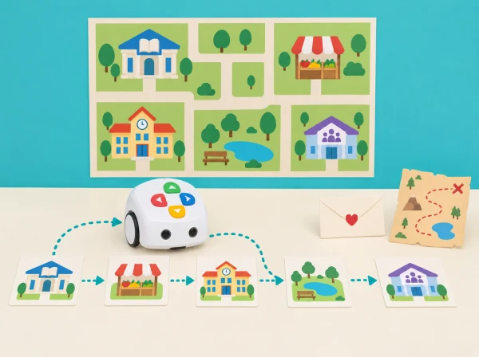

_La classe construeix mapes narratius del seu entorn amb destinacions i missatges inventats._

## 🌱 Punt de partida

La biblioteca del barri prepara un festival de relats itinerants. Els infants creen llocs, personatges i missatges i programen visites en un ordre triat pel grup. Els deu reptes adapten la categoria D de les Activity Cards: combina seqüències, bucles, expressió oral i orientació, però manté totes les històries obertes a diferents finals.

## 📚 Deu reptes globals

### **D-1 · El meu poble.**

Visita una plaça, escola, mercat i biblioteca en un recorregut propi; en cada parada, explica una funció del lloc amb dibuix, paraula o pictograma.

### **D-2 · Visitem un parc zoològic.**

Si s’utilitza un mapa interactiu oficial, exploreu els modes d’instruccions, codi i creació; amb el mapa propi, el docent narra primer una visita breu i l’alumnat n’ordena les parades. Després programa Tale-Bot per repetir el recorregut i, finalment, inventa una visita amb un altre ordre d’animals i la conta al grup. No cal tindre animals reals ni apropar-se a fauna.

### **D-3 · El xicotet missatger.**

Col·loqueu una icona de sobre i dos personatges en caselles aleatòries. Graveu, si el model ho permet i amb consentiment, un missatge breu; programeu Tale-Bot fins al sobre i després des d’allí fins al destinatari perquè el conte. Si no hi ha gravació, l’infant pot llegir una targeta o narrar en directe.

### **D-4 · La granja I.**

Poseu en el mapa una icona de tractor i una d’animal. Programeu primer el viatge al tractor i després fins a l’animal; en la segona parada, feu-li arribar un missatge amable amb la funció de gravació si està disponible. Canvieu la posició de les icones per crear i provar nous reptes.

### **D-5 · La botiga de queviures.**

Trieu una llista de compra creada pel docent, col·loqueu els aliments de paper i una caixa en el mapa i graveu «Necessite comprar…» si el robot ho permet. Programeu una sola seqüència per a visitar els productes de la llista; a cada parada, moveu la fitxa al costat del robot i, al final, arribeu a la caixa. Useu aliments dibuixats, sense demanar dades sobre les compres o dietes familiars.

### **D-6 · Ruta de patrulla com a conte.**

Trieu dues icones neutres d’un mapa de joc, marqueu una ruta que passe per totes dues i programeu Tale-Bot perquè la complete amb un sol programa. Després inventeu i conteu què ha passat en el recorregut; manteniu la patrulla en el terreny de la ficció i la convivència, sense representar detencions, emergències ni vigilància real.

### **D-7 · La granja II.**

Col·loqueu icones d’animals de granja. Canteu una cançó de granja coneguda o una alternativa pròpia i anoteu l’ordre en què apareixen els animals; programeu Tale-Bot perquè visite cada icona en eixe ordre. En acabar, conteu la seqüència o expliqueu quin animal ha aparegut primer i últim.

### **D-8 · Una missió cooperativa al castell.**

Presenteu un conte propi en què un personatge està en una situació difícil i Tale-Bot l’ajuda amb amistat. Repartiu en caselles aleatòries totes les icones del relat —inclosa la persona que rep l’ajuda— i trieu quina visitar primer. En cada arribada, retireu la targeta i poseu-la en fila; continueu fins a completar la seqüència i arribar al desenllaç. Reconteu després la història seguint l’ordre de les targetes. Es pot canviar el paper del personatge que ajuda i el final, preservant la ruta per etapes i el relat ordenat.

### **D-9 · Cerca del tresor.**

Poseu al mapa, en ordre aleatori, targetes pròpies d’una cerca: la primera és un mapa del tresor i l’última, el cofre o diamant. Trieu primer la casella del mapa, programeu el trajecte i, en cada parada, retireu la targeta i col·loqueu-la en fila. Continueu fins al tresor final i reconteu la història seguint les pistes en l’ordre recollit. Com a extensió, creeu una segona distribució; l’objectiu principal és completar i narrar la seqüència, no trobar la ruta amb menys ordres.

### **D-10 · El nostre llibre de contes preferit.**

Escolteu un conte triat per la classe i seleccioneu-ne quatre o cinc moments clau en targetes originals, sense copiar les il·lustracions del llibre. Poseu-les aleatòriament al mapa i programeu Tale-Bot perquè les visite en l’ordre narratiu correcte. En cada parada, si el model ho permet, feu que reproduïsca una frase gravada que explique aquell moment; si no, un narrador la diu en directe. Tanqueu reconstruint el conte a partir de la fila de targetes.

## 🎯 Aprenentatges i vocabulari

- Planificar una ruta amb diverses parades i un relat que es puga modificar.
- Usar ordres i bucles per representar un servei comunitari en un mapa fictici.
- Provar la seqüència, localitzar una ambigüitat i revisar les instruccions en equip.
- Comunicar la missió amb destinacions inventades, sense adreces ni dades de persones reals.

## 🧰 Materials i model real

Tale-Bot, quadrícula pròpia, icones dibuixades, targetes de personatges i cinta per fixar el mapa. L’enregistrament i el mode de missatge depenen del model Pro; si no hi són, es poden fer servir símbols i narració humana. Els mapes de l’Activity Box no són requisit.

## 🧪 Evidències i convivència

Mapa, seqüència de destinacions, programa, conte col·lectiu, prova amb un segon equip i una revisió del final. Avalueu orientació, ordre, capacitat de relatar i escolta mútua; mai la rapidesa o la interpretació personal d’un infant.

## ♿ Participació, accessibilitat i seguretat

Permeteu aportar idees per veu, dibuix, pictogrames o selecció de targetes; ningú no ha de representar una experiència personal ni parlar en públic. Les missions es resolen amb destinacions fictícies i no incorporen noms o adreces reals. Repartiu els rols de planificació, programació, observació i relat, i feu torns curts amb el robot.

## 🔗 Referent oficial adaptat

Adapta les deu targetes D —*My Town*, *Visit the Zoo*, *The Little Messenger*, *Old McDonald’s Farm I/II*, *Grocery Store*, *Patrol Car*, *Saving the Princess*, *Treasure Hunting* i *My Favorite Story Book*— de les [Activity Cards oficials](https://matatalab.com/en/lesson4.4). S’hi conserven les accions centrals de cada fitxa (visita narrada i modes del mapa; sobre i missatge; tractor i enregistrament; llista, recollida i caixa; ruta per dues icones; ordre de la cançó de granja; seqüència cooperativa d’adhesius; recorregut per pistes fins al mapa del tresor i el cofre, relat per etapes, i conte conegut reconstruït per escenes amb narració opcional en cada parada). Històries, mapes, dades i il·lustracions són originals i contextualitzats.
