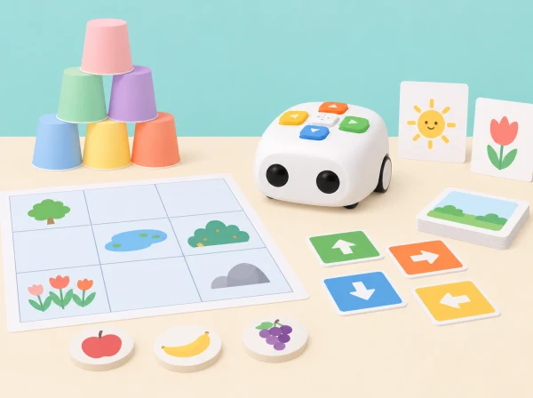

_Les instruccions es planifiquen amb targetes i es comproven al mapa; els materials i la història són propis._

## 🌱 Punt de partida

La classe organitza una fira de jocs de barri. Els equips aprenen a llegir els botons, anticipar el recorregut i corregir errors abans de prémer «Play». La progressió adapta les deu activitats oficials de la categoria A de les Activity Cards amb objectes, mapes i consignes elaborats per l’aula. Cada repte es pot resoldre també amb una graella de paper si el robot no està disponible.

## 🧭 Seqüència · 10 reptes d’una sessió

### **A-1 · Hola, Tale-Bot i al repte.**

**Objectiu:** identificar les parts i els botons, entendre què és una ordre i un programa, i comprovar visualment la seqüència introduïda.

**Preparació:** Tale-Bot Pro, esquema propi de les parts, targetes pròpies amb els botons de moviment, *Play* i esborrat, targetes de nombre de l’1 al 10 i una graella breu. Els accessoris s’exploren només si formen part del kit del centre.

#### Fase 1 · Activem i prediem

Mireu el robot apagat i l’esquema propi. Assenyaleu cos, rodes, botons, llums i interruptor; distingiu les ordres que pot executar d’una decisió humana. Acordeu una norma de cura i practiqueu l’encesa i l’apagada amb supervisió.

#### Fase 2 · Explorem i construïm

Proveu els botons de moviment, gir, *Play*, dansa, repetició, gravació i esborrat que tinga el model. Comproveu que una pulsació curta d’esborrat elimina una ordre i que mantindre’l premut esborra la seqüència completa; anoteu les funcions que la unitat del centre no incorpora.

#### Fase 3 · Expliquem i registrem

Trieu una targeta de l’1 al 10 i introduïu exactament eixe nombre d’ordres, per exemple girs i avanços en una quadrícula. Abans de prémer *Play*, una altra persona compta les targetes i les ordres enregistrades.

#### Fase 4 · Apliquem i millorem

Si els recomptes no coincideixen, esborreu i corregiu només el tram necessari. Observeu els colors dels indicadors de codificació, executeu el programa i compareu l’acció amb la predicció.

#### Fase 5 · Comprovem i reflexionem

**Evidència:** esquema de parts i controls, nombre triat, seqüència comptada, predicció, resultat i norma de cura. Expliqueu que un programa és un conjunt ordenat d’instruccions. La torre de gots pertany a A-2.
### **A-2 · Avança, avança.**

#### Fase 1 · Activem i prediem

Construïu una torre de deu gots buits i lleugers. Predigueu quantes ordres cap avant necessita Tale-Bot per arribar-hi des d’una línia d’inici marcada.

#### Fase 2 · Explorem i construïm

Representeu la seqüència amb targetes i trieu un nombre d’ordres per al primer intent. Manteniu lliure la trajectòria i no useu objectes pesants o fràgils.

#### Fase 3 · Expliquem i registrem

Anoteu el nombre d’ordres i quants gots han caigut. Compareu el resultat amb la predicció i descriviu el desplaçament observat.

#### Fase 4 · Apliquem i millorem

Recol·loqueu els gots i reinicieu Tale-Bot des de la mateixa línia per fer una prova comparable. Si el kit té un accessori d’empenta compatible, proveu-lo com a extensió i registreu el canvi; no se’n pressuposa la disponibilitat.

#### Fase 5 · Comprovem i reflexionem

**Evidència:** comparació visual de les seqüències i del desplaçament observat en dos intents comparables. Expliqueu si el robot ha arribat i quina variable podria explicar una diferència.

### **A-3 · Quants avanços?**

#### Fase 1 · Activem i prediem

Dibuixeu una graella pròpia amb cinc inicis al costat inferior (A1–E1) i una meta davant de cadascun. Predigueu quina ruta necessita més avanços.

#### Fase 2 · Explorem i construïm

Situeu Tale-Bot orientat cap a la meta i compteu quantes ordres «avant» el separen. Registreu la seqüència amb targetes abans de programar.

#### Fase 3 · Expliquem i registrem

Observeu els indicadors verds per comprovar el recompte i anoteu inici, orientació, nombre d’ordres i meta de cada ruta.

#### Fase 4 · Apliquem i millorem

Executeu les cinc rutes i compareu les distàncies en ordres. Si un trajecte no correspon, reviseu l’orientació abans de canviar-ne el recompte.

#### Fase 5 · Comprovem i reflexionem

**Evidència:** graella amb seqüències verificades. Compareu quina ruta requereix més o menys ordres mantenint la fila i l’orientació inicial.

### **A-4 · Codi de l’aula I.**

#### Fase 1 · Activem i prediem

Expliqueu que un programa és un conjunt d’instruccions en un ordre concret. Observeu sis programes visuals propis i predigueu què farà Tale-Bot abans de prémer *Play*.

#### Fase 2 · Explorem i construïm

Una parella introdueix les ordres de cada targeta en el mateix ordre. Comproveu visualment els indicadors de colors abans d’executar.

#### Fase 3 · Expliquem i registrem

Pinteu en una targeta pròpia els colors dels indicadors que representen cada programa. Anoteu les accions que espereu després de cada seqüència.

#### Fase 4 · Apliquem i millorem

Una altra parella rep la targeta de colors sense veure el robot i reprodueix la seqüència. Compareu la interpretació amb el programa original i corregiu qualsevol ordre ambigua.

#### Fase 5 · Comprovem i reflexionem

**Evidència:** sis programes amb predicció, indicadors i acció comprovada, més una targeta de colors que una altra parella ha pogut interpretar.

### **A-5 · Ens coneixem.**

#### Fase 1 · Activem i prediem

Col·loqueu Tale-Bot i una figureta o targeta de personatge en la mateixa línia. Trieu una salutació pròpia i predigueu quantes ordres necessita el robot per arribar-hi.

#### Fase 2 · Explorem i construïm

Practiqueu el botó de gravació només si el model ofereix aquesta funció. Manteniu-lo premut més d’un segon per enregistrar; feu una pulsació breu per reproduir només si el model ho permet.

#### Fase 3 · Expliquem i registrem

Representeu la ruta amb targetes i decidiu com s’expressarà la salutació: àudio consentit, pictograma o missatge oral en directe.

#### Fase 4 · Apliquem i millorem

Programeu el recorregut fins al personatge i feu la salutació en arribar. Reviseu la seqüència si no acaba en la casella prevista.

#### Fase 5 · Comprovem i reflexionem

**Evidència:** ruta i salutació triada pel grup. La veu és voluntària; no cal enregistrar-la per completar el repte.

### **A-6 · Taller de dansa.**

#### Fase 1 · Activem i prediem

Poseu Tale-Bot i una targeta d’escenari en la mateixa línia. Predigueu el tram d’anada i el de tornada perquè el robot acabe al punt d’inici.

#### Fase 2 · Explorem i construïm

Planifiqueu les ordres cap avant i arrere i decidiu on s’activarà la dansa, si el model incorpora aquesta funció.

#### Fase 3 · Expliquem i registrem

Dibuixeu la ruta i registreu la distància de cada tram en ordres. Indiqueu quina acció del programa correspon a l’escenari.

#### Fase 4 · Apliquem i millorem

Proveu quatre disposicions de distància diferent i reinicieu sempre des de la mateixa marca. Ajusteu les ordres si el robot no torna a l’inici.

#### Fase 5 · Comprovem i reflexionem

**Evidència:** quatre rutes de prova amb un retorn verificat. La dansa és una acció del robot; cap infant no ha de ballar si no vol.

### **A-7 · Gir a esquerra o dreta?**

#### Fase 1 · Activem i prediem

Prepareu quatre parelles de targetes d’antònims i mapes propis. Abans de donar una ordre, una persona assenyala esquerra o dreta des del punt de vista del robot.

#### Fase 2 · Explorem i construïm

Completeu cada programa amb «gira a l’esquerra» o «gira a la dreta» perquè Tale-Bot arribe a la targeta indicada. Comproveu l’orientació inicial.

#### Fase 3 · Expliquem i registrem

Anoteu la targeta objectiu, el gir triat i la posició final prevista. Una altra persona comprova que la instrucció descriu la direcció des del robot.

#### Fase 4 · Apliquem i millorem

Executeu les quatre rutes. Si hi ha desviació, canvieu només el gir que la causa i repetiu la prova.

#### Fase 5 · Comprovem i reflexionem

**Evidència:** quatre programes depurats i un repte nou creat per l’alumnat amb la seua solució.

### **A-8 · Codi de l’aula II.**

#### Fase 1 · Activem i prediem

Llegiu sis programes visuals propis i predigueu el moviment, els girs i el missatge que espereu en cada cas.

#### Fase 2 · Explorem i construïm

Introduïu les ordres exactes de cada targeta i creeu missatges neutres sobre una fira o una biblioteca, en lloc de copiar les frases alimentàries del fabricant.

#### Fase 3 · Expliquem i registrem

Pinteu els colors dels indicadors en una targeta de programació per a un dels casos. Anoteu el resultat esperat abans de prémer *Play*.

#### Fase 4 · Apliquem i millorem

Executeu els sis programes i compareu moviment, girs i missatge amb la targeta model. Feu que un altre equip interprete el codi de colors sense veure el robot.

#### Fase 5 · Comprovem i reflexionem

**Evidència:** sis seqüències provades i una targeta interpretada per un altre equip. Expliqueu quina informació del programa permetia anticipar el resultat.

### **A-9 · Collim fruita de temporada.**

#### Fase 1 · Activem i prediem

Trieu una fruita de temporada per al mapa propi i predigueu quina ruta arriba des de Tale-Bot fins a la casella.

#### Fase 2 · Explorem i construïm

Dibuixeu el recorregut amb retolador esborrable, traduïu-lo a targetes d’ordre i marqueu el punt d’inici.

#### Fase 3 · Expliquem i registrem

Anoteu la seqüència i decidiu quina acció de celebració s’activarà en arribar. Una frase gravada és opcional i requereix consentiment i funció compatible.

#### Fase 4 · Apliquem i millorem

Programeu el robot per arribar a la fruita i fer una dansa si el model ho permet. Esborreu la ruta abans que un altre equip prove una trajectòria diferent.

#### Fase 5 · Comprovem i reflexionem

**Evidència:** ruta prevista i executada, més una celebració triada. Expliqueu què s’ha mantingut igual i què ha canviat en la ruta del segon equip.

### **A-10 · Guardes del parc I.**

#### Fase 1 · Activem i prediem

Col·loqueu Tale-Bot i una joguina lleugera en una superfície plana. Predigueu quines ordres permetran passar al voltant de l’objecte sense tocar-lo.

#### Fase 2 · Explorem i construïm

Dibuixeu el camí i representeu les instruccions amb targetes. Comproveu que el trajecte queda lluny de la vora i que l’objecte no és fràgil ni rígid.

#### Fase 3 · Expliquem i registrem

Anoteu les ordres de cada tram al voltant de l’objecte i indiqueu el punt on el robot ha de reprendre la direcció inicial.

#### Fase 4 · Apliquem i millorem

Proveu el programa amb un objecte. Com a repte, separeu dos objectes i dissenyeu una sola seqüència que passe al voltant de tots dos sense tocar-los.

#### Fase 5 · Comprovem i reflexionem

**Evidència:** camí dibuixat, programa únic i comprovació del recorregut. Expliqueu com heu comprovat que hi havia prou espai al voltant dels objectes.

## 🎯 Aprenentatges i vocabulari

- Identificar ordres de moviment i combinar-les en seqüències amb inici i final.
- Predir la posició final del Tale-Bot i comprovar-la en una quadrícula pròpia.
- Localitzar una ordre de més, de menys o en direcció incorrecta i depurar-la.
- Explicar una ruta perquè una altra persona la puga reproduir amb targetes o amb el robot.

## 🧰 Materials i diferències de model

Tale-Bot de la dotació, targetes de fletxes impreses pel centre, graella, gots de paper, peces planes i cinta de pintor. Gravació de veu, indicadors, botó de repetició i accessoris varien segons el model: comproveu-los abans. Si una funció no està disponible, representeu-la amb una targeta o una ordre oral; no s’atribueix al robot una capacitat absent.

## 🧪 Avaluació i adaptacions

Recolliu predicció, seqüència de targetes, recorregut observat i correcció d’un error. Accepteu resposta oral, gestual, pictogràfica o amb codi. Roten els papers de planificador, operador i observador; cap infant queda associat a un rol fix.

## ♿ Participació, accessibilitat i seguretat

Comenceu amb poques ordres i una quadrícula clara; oferiu fletxes grans, fitxes tàctils o una ruta de paper abans de prémer els botons del robot. La participació pot ser assenyalar, anticipar, ordenar targetes, comprovar o narrar. Manteniu les mans fora de les rodes quan el Tale-Bot estiga en moviment i pareu-lo abans de canviar-ne el recorregut.

## 🔗 Referents oficials adaptats

Adapta les deu targetes de categoria A —*Hello, Tale-Bot*, *Forward, Forward*, *How Many “Forwards”?*, *Tale-Bot Classroom I*, *Nice to Meet You!*, *Tale-Bot Loves Dancing*, *Turn Left or Turn Right?*, *Tale-Bot Classroom II*, *Fruit Picking* i *Tale-Bot Guard I*— de les [Activity Cards per a Tale-Bot Pro](https://matatalab.com/en/lesson4.4). L’activitat A-1 també es basa en la primera lliçó pública del currículum, [«Hola, robot Matata»](https://matatalab.com/zh-hans/node/827), que proposa conéixer l’estructura i els botons, encendre i apagar el robot, despertar curiositat i practicar-ne la cura; la pàgina enumera model de paper, robot, accessoris de muntatge i deu gots de paper entre els materials. La fitxa pròpia explicita aquests objectius i transforma els gots en una ruta de predicció i prova. El PDF i la presentació de la lliçó no s’han pogut llegir, de manera que no afirmem reproduir-ne el guió ni la construcció exacta. Les nostres targetes, model i mapa són propis; no reutilitzem materials gràfics del fabricant.
