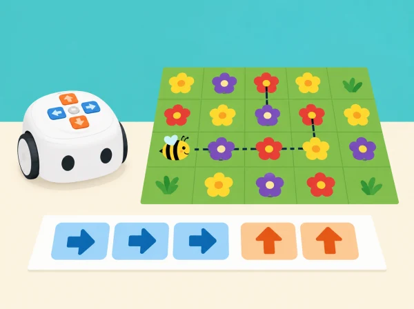

_Els grups detecten patrons en paper, els tradueixen a ordres i comparen la ruta amb bucle._

## 🌱 Punt de partida

El parc del barri prepara una gimcana i necessita rutes repetibles. L’alumnat busca unitats que tornen a aparéixer, crea bucles amb la tecla física de repetició quan el model la incorpora i valida el programa amb una execució. Aquesta seqüència adapta les set targetes de reconeixement de patrons de la categoria C.

## 🔁 Set reptes

### **C-1 · Busca la unitat que torna.**

#### Fase 1 · Activem i prediem

Repartiu tires pròpies amb patrons de fruites, formes i sons del paisatge de l’horta. Predigueu quin element vindrà després d’una tira i expliqueu quina regla heu detectat.

#### Fase 2 · Explorem i construïm

Encerclau la unitat mínima que es repeteix i representeu la regla amb targetes, veu o moviment voluntari. Compteu quantes vegades apareix.

#### Fase 3 · Expliquem i registrem

Completeu una seqüència nova en què falta l’últim grup i registreu la unitat repetida i el recompte.

#### Fase 4 · Apliquem i millorem

Creeu una tira perquè una altra parella n’endevine la regla. Reviseu-la si admet diverses continuacions possibles que no havíeu previst.

#### Fase 5 · Comprovem i reflexionem

**Evidència:** patró marcat, recompte i seqüència inventada. Expliqueu la diferència entre repetir el mateix patró i copiar la tira sencera.

### **C-2 · Una dansa amb repetició.**

#### Fase 1 · Activem i prediem

Prepareu cinc programes breus de dificultat creixent: acció única, canvi de direcció, parell d’accions, patró de dos passos repetit i seqüència amb pausa o dansa. Abans de cada intent, predigueu quins indicadors s’encendran i quantes repeticions hi haurà.

#### Fase 2 · Explorem i construïm

Introduïu els programes i anoteu els indicadors de codi i bucle que observeu. Comproveu quines funcions mostra realment el model de la dotació.

#### Fase 3 · Expliquem i registrem

En el cinqué repte, dissenyeu un patró de dos moviments i una pausa. Registreu-lo primer amb ordres repetides una per una.

#### Fase 4 · Apliquem i millorem

Introduïu el mateix patró amb el botó físic de repetició i compareu les dues execucions. Si la funció no està disponible o no és clara, representeu el bucle amb targetes i peces sobre paper.

#### Fase 5 · Comprovem i reflexionem

**Evidència:** dos programes equivalents i una explicació de què resumeix el bucle. Els moviments corporals són opcionals.

### **C-3 · Comprimim i provem programes.**

#### Fase 1 · Activem i prediem

Prepareu cinc seqüències pròpies de fletxes amb una part repetida. Predigueu la posició final abans de comprimir el programa.

#### Fase 2 · Explorem i construïm

Marqueu la unitat repetida, compteu-ne les ocurrències i decidiu quantes vegades cal usar el comandament de repetició.

#### Fase 3 · Expliquem i registrem

Registreu la seqüència llarga, la unitat identificada, el nombre de repeticions i la posició final prevista.

#### Fase 4 · Apliquem i millorem

Reescriviu cada programa amb el botó físic i compareu recorregut i posició final amb la versió llarga. Si la dotació no ofereix el botó, feu la representació compacta amb targetes i indiqueu-ho.

#### Fase 5 · Comprovem i reflexionem

**Evidència:** programa original, repetició identificada, versió curta i resultat. Com a ampliació, creeu una ruta més llarga i acordeu una regla d’aturada segura.

### **C-4 · Una abella visita flors semblants.**

#### Fase 1 · Activem i prediem

Col·loqueu flors de paper del mateix color en una maqueta del jardí escolar. Predigueu quines ordres portarien Tale-Bot des de l’inici fins a totes les flors.

#### Fase 2 · Explorem i construïm

Dibuixeu una ruta que visite cada flor. La docent presenta una tira d’instruccions i el grup observa quins botons i indicadors s’activen.

#### Fase 3 · Expliquem i registrem

Marqueu la part repetida de la ruta i anoteu quantes vegades s’ha d’executar. Comproveu cada parada esperada al mapa.

#### Fase 4 · Apliquem i millorem

Introduïu les ordres i useu la funció repetir per crear una seqüència. Proveu-la des del mateix punt d’inici i reviseu la ruta si alguna flor queda sense visitar.

#### Fase 5 · Comprovem i reflexionem

**Evidència:** mapa, predicció del codi i verificació de les parades. La metàfora no representa una abella real ni simula la pol·linització.

### **C-5 · Protegeix l’illa del jardí.**

#### Fase 1 · Activem i prediem

Poseu un objecte tou gran damunt d’una illa de cartó. Predigueu una ruta que el rodege sense tocar-lo i torne al punt de partida.

#### Fase 2 · Explorem i construïm

Traceu la ruta amb targetes i copieu les ordres en paper. Encerclau els trams iguals que podrien formar un bucle.

#### Fase 3 · Expliquem i registrem

Registreu el codi llarg, els trams repetits i l’orientació inicial. Indiqueu on ha de quedar el robot quan complete el recorregut.

#### Fase 4 · Apliquem i millorem

Reorganitzeu la seqüència amb el botó de repetició i executeu les dues versions des de la mateixa orientació. Si afegiu un segon objecte, predigueu primer quina part del programa haurà de canviar.

#### Fase 5 · Comprovem i reflexionem

**Evidència:** codis llarg i compacte, ruta marcada i retorn comprovat sense tocar l’objecte.

### **C-6 · Recorregut de carlotes de cartó.**

#### Fase 1 · Activem i prediem

Col·loqueu tres fitxes de carlota en un mapa de bancals inspirat en l’horta valenciana. Predigueu l’ordre de visita i el nombre d’ordres necessari.

#### Fase 2 · Explorem i construïm

Marqueu la ruta amb retolador rentable sobre el mapa o amb una tira de caselles. Codifiqueu el trajecte que visita les tres fitxes.

#### Fase 3 · Expliquem i registrem

Localitzeu les ordres repetides i registreu el codi llarg i el nombre de visites previst.

#### Fase 4 · Apliquem i millorem

Substituïu les ordres repetides pel botó físic de repetició. Abans de prémer *Play*, una altra persona comprova que la ruta curta visita els mateixos punts. Proveu-la amb el retolador només si el suport i el retolador originals són a la dotació; altrament, useu una fitxa de paper.

#### Fase 5 · Comprovem i reflexionem

**Evidència:** ruta dibuixada, versió optimitzada i registre de visites correctes. Indiqueu clarament si el traçat ha sigut automàtic o manual.

### **C-7 · Collim carabasses de paper.**

#### Fase 1 · Activem i prediem

Dissenyeu un repte final amb peces grans de carabassa i una ruta marcada. Incloeu com a mínim dos fragments repetits i predigueu la seqüència de visites.

#### Fase 2 · Explorem i construïm

Planifiqueu les ordres amb targetes i escriviu el programa llarg. Identifiqueu cada unitat repetida i el nombre de repeticions.

#### Fase 3 · Expliquem i registrem

Prepareu el mapa i la predicció per a un altre equip, sense donar-li el codi. Registreu la posició esperada després de cada fragment.

#### Fase 4 · Apliquem i millorem

Feu la versió compacta amb el botó de repetició i demaneu a l’altre equip que execute els dos codis. Si divergeixen, localitzeu el primer punt diferent i reviseu només el fragment corresponent.

#### Fase 5 · Comprovem i reflexionem

**Evidència:** repte creat, predicció d’un altre equip, prova i depuració justificada. Expliqueu si les dues versions visiten les mateixes fites en el mateix ordre.

## 🎯 Aprenentatges i vocabulari

- Identificar una unitat que es repeteix en un patró de moviments o símbols.
- Expressar una repetició amb ordres més breus sense perdre la seqüència prevista.
- Provar patrons diferents i detectar en quin punt deixa de coincidir el resultat.
- Crear una ruta rítmica o visual i explicar-ne la regla a una altra parella.

## 🧰 Materials i accés

Tale-Bot, graella dibuixada pel centre, targetes de fletxes, peces planes i llapis de colors. No cal Activity Box: les targetes de joc i el mapa es poden confeccionar amb caselles pròpies. Comproveu el botó de repetició i les funcions de cada versió.

## 🧪 Evidències

Patró marcat, seqüència llarga, versió compacta, nombre de repeticions i registre de prova. L’alumnat explica quan un bucle és més clar i quan pot amagar un error.

## ♿ Participació, accessibilitat i seguretat

Representem cada instrucció amb forma i símbol a més de color, i oferim una pauta de patró manipulable amb targetes. Qui no vulga conduir el robot pot predir, ordenar, observar o registrar el trajecte. Comenceu amb una ruta curta en superfície plana i afegiu ordres només quan l’equip puga explicar el patró.

## 🔗 Referent oficial adaptat

Adapta les set targetes C —*Find the Patterns*, *Tireless Dancer*, *Capable Repeat Button*, *Hardworking Bees*, *Tale-Bot Guard II*, *Carrot Picking* i *Pumpkin Picking*— de les [Activity Cards oficials](https://matatalab.com/en/lesson4.4). Les rutes i cartes són originals i l’ús del bucle s’ajusta a les ordres realment disponibles.
