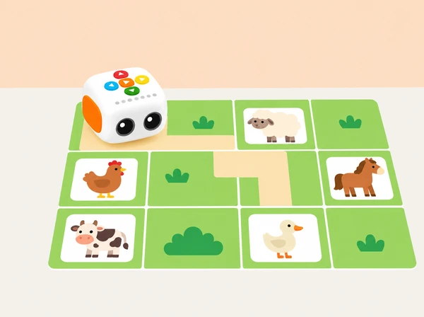

_El mapa i les cinc targetes d’animals són materials propis; Tale-Bot conserva el disseny del robot real._

## ❓ Repte i intenció

**Situació:** Una aula prepara un mapa d’un corral o d’un paisatge agrari valencià perquè Tale-Bot visite cinc animals. El mapa, les imatges i les targetes són originals; la classe practica la mateixa idea central de la lliçó pública: preparar un mapa i completar-hi un repte amb ordres cap avant.

**Pregunta guia:** Quantes ordres cap avant necessita el robot per a arribar a cada animal, i com podem comprovar que el programa és correcte?

## 🎯 Aprenentatges i vocabulari

- Orientar-se en una graella amb files, columnes i un punt inicial acordat.
- Programar rutes a cinc destinacions amb ordres cap avant que es puguen comptar.
- Comparar predicció i trajecte i corregir una instrucció concreta quan no coincideixen.
- Explicar les decisions amb un mapa de paper sense atribuir al robot la capacitat d’identificar animals.

## Abans de començar

**Materials:** Tale-Bot, graella plana en blanc, targetes pròpies de fletxes, cinc imatges grans d’animals, fitxes adhesives o marcadors reposicionables i una marca d’inici orientada. Les targetes pròpies fan la funció de les targetes de comandament i els adhesius del material oficial, sense reutilitzar-ne els elements gràfics.

Comproveu la distància de moviment en el Tale-Bot disponible: el valor predeterminat és d’uns 10 cm i alguns models permeten configurar 15 cm. Consulteu [Primeres passes amb Tale-Bot Pro](../../tutorial/index.html?id=tb-primeres-passes) abans de definir la graella. Per a practicar només ordres cap avant, poseu les metes en el corredor davant del robot i reorienteu-lo en reiniciar cada repte.

## 📅 Seqüència didàctica · 3 sessions

### **Sessió 1 · Dissenyem i llegim el mapa.**

#### Fase 1 · Activem i prediem

Exploreu què representa el mapa i predigueu com es pot indicar una destinació sense tapar les caselles.

#### Fase 2 · Explorem i construïm

Observeu què indiquen les targetes de fletxes i com es poden moure les fitxes adhesives sense cobrir el recorregut.

#### Fase 3 · Expliquem i registrem

Marqueu files i columnes amb lletres, nombres o un altre codi visual. Practiqueu descriure una posició i compteu les caselles.

#### Fase 4 · Apliquem i millorem

Col·loqueu cinc animals i una marca d’inici orientada. Si trieu fauna valenciana, contrasteu els noms amb una font local fiable. Torneu a col·locar el mapa igual després de cada ronda.

#### Fase 5 · Comprovem i reflexionem

**Evidència:** mapa amb llegenda, files, columnes, inici orientat i cinc metes. Una altra parella pot descriure correctament una destinació?

### **Sessió 2 · Programem cinc arribades.**

#### Fase 1 · Activem i prediem

Una persona tria un animal i l’equip localitza la destinació al mapa.

#### Fase 2 · Explorem i construïm

Compteu les caselles entre inici i meta i col·loqueu les targetes «avant» en l’ordre previst.

#### Fase 3 · Expliquem i registrem

Verbalitzeu la predicció. Abans de prémer *Play*, compteu els indicadors lluminosos i comproveu que n’hi ha un per cada ordre.

#### Fase 4 · Apliquem i millorem

Executeu la ruta, recolliu un marcador en arribar i repetiu amb els altres quatre animals, reiniciant des de la marca orientada. Si Tale-Bot no arriba, compareu la posició final amb la predicció abans de canviar el programa.

#### Fase 5 · Comprovem i reflexionem

**Evidència:** cinc seqüències amb predicció, destinació i comprovació dels indicadors. Quina comprovació us ha permés detectar abans una ordre absent?

### **Sessió 3 · Comparem, depurem i expliquem.**

#### Fase 1 · Activem i prediem

Ordeneu les cinc rutes de la que necessita menys ordres a la que en necessita més i predigueu quina serà més llarga.

#### Fase 2 · Explorem i construïm

Poseu els recomptes costat per costat i comproveu que tots parteixen de la mateixa casella, orientació i destinació. Marqueu en el mapa els trams rectes i els girs: dues rutes poden tindre el mateix nombre d’ordres i longitud diferent, o a l’inrevés. Si hi ha desacord, reconstruïu una ruta amb una fitxa abans de tornar a programar Tale-Bot. Registreu també si la diferència prové del recorregut o de com s’ha comptat una ordre.

#### Fase 3 · Expliquem i registrem

Trieu una ruta que haja acabat abans o després de la fita. Comproveu recompte, mida de la quadrícula, orientació i indicadors; anoteu on va deixar de coincidir amb la predicció.

#### Fase 4 · Apliquem i millorem

Corregiu una sola cosa i repetiu des del mateix punt. Expliqueu quina ruta era més llarga o més curta i quin indici ha ajudat a trobar l’error.

#### Fase 5 · Comprovem i reflexionem

**Evidència:** seqüència abans/després, correcció explicada i resposta oral, gestual o pictogràfica. Quina ordre heu canviat i quina observació justifica la decisió?

## Conducció de les sessions

La lliçó pública de Matatalab organitza aproximadament 10 minuts de presentació guiada, 30 de pràctica en parelles i 5 de retorn. Aquesta adaptació la distribueix en tres trobades breus per poder construir el mapa, fer cinc intents amb calma i revisar els errors sense pressa. Si es disposa d'una sessió llarga, es pot mantindre la mateixa seqüència amb una pausa entre la pràctica guiada i els intents autònoms.

En la primera trobada, modeleu només una ruta, amb l'inici i l'orientació assenyalats. En la segona, doneu temps per a les cinc metes: abans de cada prova, l'equip anuncia files/columnes, recompte de caselles i nombre d'ordres; després, un company verifica els indicadors de codificació del robot. En la tercera, compareu les seqüències en una tira comuna i trieu-ne una per depurar. No reprogramar la ruta sencera quan una ordre falla ajuda a mantindre el focus en el pas que cal revisar.

El pas de 10 cm és la configuració predeterminada descrita al manual; la targeta de configuració permet una opció de 15 cm en el model corresponent. Per tant, la quadrícula local ha d'usar la mesura activa al robot concret. Si una casella no coincideix exactament, marqueu el mapa com a model aproximat i feu una prova d'alineament abans de col·locar les metes.

## 📋 Avaluació i evidències

Observeu si cada infant pot reconèixer files i columnes, descriure una casella o coordenada, orientar el robot, comptar caselles, traduir el recompte en ordres cap avant, comparar l’extensió de programes i usar els indicadors com a comprovació visual. Arxiveu el mapa, la seqüència, la predicció, el resultat i la revisió d’un error. Valoreu que l’alumnat puga explicar com ha sabut quina ordre canviar, no la velocitat.

## ♿ Més d’una manera de participar

Reduïu la graella a poques caselles, marqueu el nord del recorregut o oferiu fletxes amb relleu. Es pot assenyalar la destinació, dictar el programa, moure una fitxa que represente Tale-Bot o observar i registrar-ne el recorregut.

## 🔗 Lliçó oficial i adaptació

Adapta la segona lliçó del primer nivell de Tale-Bot Pro, [«On són els animals de la granja?»](https://matatalab.com/zh-hans/node/829). La pàgina i el PDF adjunt especifiquen introducció a animals, recompte de files i columnes, marca d’inici orientada, metes identificades al mapa, seqüències amb ordres cap avant, comprovació per indicadors lluminosos, recollida de cinc animals i comparació de quina ruta en requereix més o menys. La fitxa pròpia conserva aquests aprenentatges i els trasllada a una quadrícula i targetes originals; no reutilitza la presentació, el full de treball, les imatges ni el mapa del fabricant.
