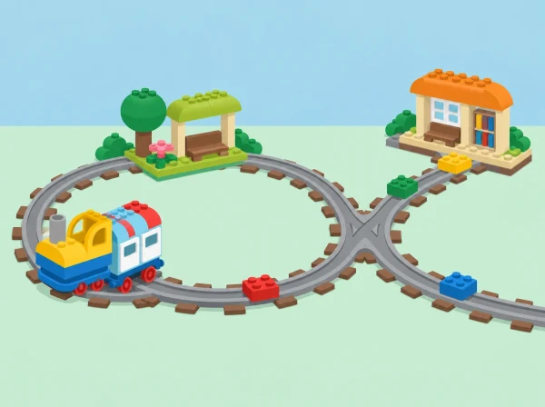

_La xarxa, les estacions i la càrrega són una maqueta original. L'alumnat observa el tren real i comprova les seues prediccions._

## Context i repte

La classe rep una missió: imaginar una línia de tren que connecte tres llocs pròxims —una horta, un mercat i l'escola— i transportar una càrrega simbòlica sense perdre-la. La maqueta no pretén reproduir el mapa real ni afirmar que un mitjà de transport no tinga impacte. Serveix per parlar de connexions, parades, capacitat, recorreguts i de les persones que necessiten informació clara per orientar-se.

La situació pren com a referent activitats oficials de Coding Express sobre bucles, bifurcacions i distàncies; la història, el plànol i els criteris de disseny són propis. Abans de començar, reviseu el manual del kit disponible al centre, perquè la configuració i les peces poden variar.

## Intencions d'aprenentatge

- Construir una via estable que connecte almenys tres estacions i descriure'n el recorregut amb paraules, gestos o pictogrames.

- Anticipar què farà el tren en un tram recte, un bucle o una bifurcació, provar-ho i ajustar la predicció amb evidències.

- Reconéixer que una ruta pot ser més curta i, alhora, menys clara o menys adequada per a la missió triada.

- Coordinar-se en el muntatge, respectar torns i explicar les decisions amb vocabulari espacial: davant, darrere, abans, després, gir i parada.

- Relacionar el transport col·lectiu amb una conversa inicial sobre mobilitat i sostenibilitat, sense simplificar-ne els impactes.

## Materials i preparació

Utilitzeu les vies, el tren i els elements d'acció inclosos en el Coding Express del centre, les targetes de colors del kit, cartolina per al mapa, blocs de construcció per a les estacions i una càrrega lleugera, gran i estable. No inventeu correspondències entre colors i ordres: consulteu la guia del fabricant i deixeu visibles les peces que realment té el kit. Prepareu una zona de muntatge a terra o sobre una taula baixa amb espai per circular sense xafar les vies.

Trieu tres estacions amb pictogrames: horta, mercat i escola. La càrrega pot ser una peça de construcció o una imatge, mai aliment real si això complica higiene o al·lèrgies. Marqueu un punt de partida, una destinació i una pregunta per a cada prova. Feu una revisió de seguretat de peces menudes i delimiteu l'espai de joc segons l'edat.

## Seqüència d'aprenentatge

### Sessió 1 — Què necessita una línia de tren? (35–40 min)

**Conversació (8 min):** observeu imatges o pictogrames d'estacions i penseu què ajuda a saber on som: nom, color, símbol, ordre de les parades. **Disseny (10 min):** en grups, ordeneu les tres estacions en una tira de paper i dibuixeu una primera ruta amb fletxes. **Construcció (15 min):** uniu vies rectes i corbes senzilles; comproveu que les unions queden fermes. **Predicció (5 min):** assenyaleu amb el dit el camí que espereu que faça el tren abans d'engegar-lo.

### Sessió 2 — Provar, descriure i depurar (35–40 min)

Feu circular el tren sense càrrega. Una persona el posa en marxa seguint el procediment del kit; una altra descriu el trajecte; la tercera observa si s'ha completat. Si s'atura o es desvia, atureu-vos i reviseu una cosa cada vegada: unió de vies, posició del tram d'acció o orientació de l'element segons el manual. Registreu-ho amb tres dibuixos: «esperàvem», «ha passat» i «canviarem». No afegiu moltes peces alhora, perquè serà difícil saber quina modificació ha produït l'efecte.

### Sessió 3 — Bucle i bifurcació (35–40 min)

Compareu una ruta amb bucle i una amb bifurcació, si el material de què disposeu ho permet. Abans de la prova, pregunteu: tornarà el tren al mateix lloc?, quines opcions veiem?, on pot parar? Marqueu la ruta amb fletxes grans i expliqueu-la a un altre grup. Si el kit no permet la configuració prevista, representeu-la primer amb una via dibuixada o amb una fitxa que es mou sobre el mapa: l'objectiu és la predicció i el raonament, no forçar el mecanisme.

### Sessió 4 — La línia verda i la càrrega (35–40 min)

Trieu quin trajecte completarà la missió horta–mercat–escola. Compareu dues opcions amb criteris visibles: nombre de trams, quantitat de parades i facilitat d'explicar l'ordre. Col·loqueu la càrrega estable i repetiu la prova. Si cau, observeu si el suport està centrat i si la via o el tren vibren; simplifiqueu la càrrega i torneu a provar. Tanqueu amb una presentació curta: «La nostra ruta connecta…, hem triat… perquè…, i encara no sabem…».

## Rols i participació

Distribuïu els rols de constructor/a, guia del mapa, encarregat/da de la prova i narrador/a. Els rols roten entre sessions. Es pot participar sense manipular el tren: assenyalar el mapa, fer la predicció, col·locar una targeta, descriure el resultat o comprovar si s'han respectat els torns. Acordeu com demanar una pausa abans de tocar la maqueta d'un altre equip.

## Avaluació i evidències

- Mapa amb les tres estacions, l'ordre de la ruta i un símbol per indicar el punt de partida.

- Registre de predicció i resultat d'una prova, amb una modificació justificada.

- Observació de la coordinació: escolta, torns, cura del material i participació en una decisió comuna.

- Explicació oral, gestual o visual d'un bucle o d'una bifurcació observada.

- Presentació final que diu quin criteri va guiar el recorregut i quina limitació té la maqueta.

Durant les proves, feu preguntes breus: «Què penseu que passarà?», «Què ha canviat?», «Quina part podem revisar?» i «Com ho explicaries a algú que no veu el tren?». Valoreu el procés de raonament i revisió, no que el tren complete la ruta a la primera.

## Inclusió, diferenciació i continuïtat

Reduïu el nombre d'estacions o oferiu un mapa amb pictogrames si cal; amplieu el repte amb dues rutes alternatives o amb instruccions per a un grup nou. Feu servir fletxes grans, codis de forma a més de color i una demostració visual pas a pas. Per a alumnat que preferisca un rol observador, doneu-li una graella amb els moments de parada i els resultats. Les aportacions de cada infant es poden recollir amb una foto del mapa, un àudio breu o una frase dictada.

## Transferència i referents

Compareu el plànol de la maqueta amb un mapa senzill del barri: tots dos representen llocs, però no mostren totes les característiques del trajecte. Parleu de distància, freqüència, accessibilitat i necessitats diferents sense decidir que una única ruta és la millor per a tothom. Les activitats oficials de LEGO Education ofereixen referents per treballar [bucles](https://education.lego.com/es-es/lessons/preschool-coding-express/o-shaped-track-looping/), [rutes amb bifurcació](https://education.lego.com/es-es/lessons/preschool-coding-express/y-shaped-track/) i [comparació de distàncies](https://education.lego.com/es-es/lessons/preschool-coding-express/math-distance/); aquesta situació crea un context propi per connectar eixes idees amb les estacions del barri.
