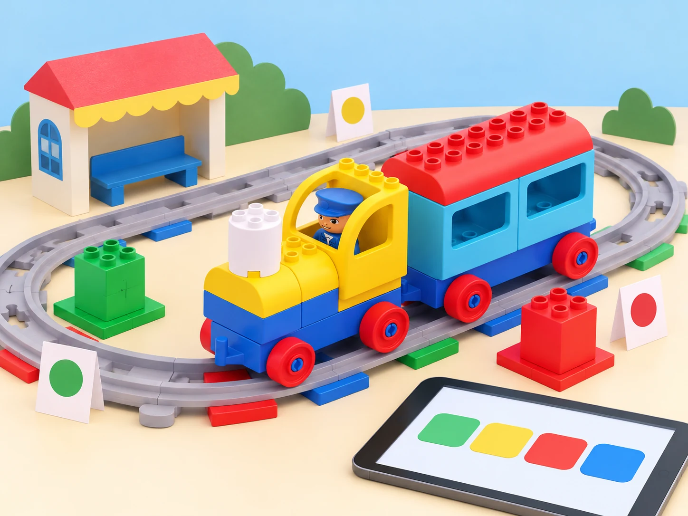

## 🎯 Repte i objectius

Dissenyeu una ruta de tres parades que explique una història amb sons i emocions. Mesureu i compareu els trams i comproveu quines respostes dels maons d’acció canvien quan s’utilitza l’app Coding Express. El motor del tren no mesura la distància: la classe marca i mesura els trams a la via.

## 🧰 Materials i preparació

- Tren LEGO DUPLO Coding Express de la dotació, via i maons d’acció disponibles.
- App Coding Express en un dispositiu compatible, si encara està instal·lada i funciona al centre.
- Cinta de paper i regle/cinta mètrica per marcar i comparar trams.
- Targetes de parada, emoció i so; alternativa desconnectada amb pictogrames si l’app no està disponible.

Comproveu l’estat de les piles, que el tren es connecta a l’app i que el sensor llig els maons d’acció presents. El conjunt està retirat comercialment; aquesta pràctica pressuposa que el centre ja el té. No substituïu les funcions de l’app amb un comportament imaginat si la versió instal·lada no les ofereix.

## 🧩 Funcions del robot treballades

- Personalització de la resposta dels maons d’acció a l’app Coding Express.
- Composició d’una seqüència musical/sonora amb accions ordenades a la via.
- Relació entre senyals de trànsit, seqüència i presa de decisions en una ruta.
- Mesura i comparació externa de distàncies recorregudes; no hi ha sensor de distància al tren.

## 👣 Seqüència guiada

### 1. Prepareu tres parades i una escala

Construïu una via recta o amb un recorregut senzill. Marqueu tres estacions i mesureu la distància entre elles amb la cinta mètrica; anoteu els centímetres i convertiu-los, si convé, en unitats de via. Abans d’encendre el tren, ordeneu les parades i prediu quin tram és més llarg.

### 2. Connecteu l’app i personalitzeu una acció

Si la versió de l’app és compatible, connecteu-hi el tren segons les instruccions que mostra i observeu l’acció associada a cada maó. Canvieu una sola resposta d’un maó segons les opcions disponibles i proveu-lo en una ruta curta. Compareu el resultat amb el comportament inicial. Si la connexió o l’app no funciona, passeu a l’alternativa amb targetes: representeu les mateixes respostes com a símbols, sense afirmar que s’han canviat dins del robot.

### 3. Compondreu un concert de parades

Ordeneu tres maons d’acció per crear una seqüència sonora pròpia. Feu una primera execució i registreu l’ordre dels sons; després intercanvieu dos maons i prediu què canviarà. Relacioneu cada so amb un senyal o una emoció fictícia, sense associar emocions fixes a l’alumnat. Si l’app permet canviar la resposta dels maons, compareu la melodia original amb la personalitzada.

### 4. Resoleu una ruta amb senyals

Afegiu un senyal de trànsit de paper a cada parada (aturar-se, continuar o tornar) i planifiqueu una ruta segura per al tren. Executeu-la a baixa velocitat; compteu les unitats de via entre estacions i compareu-les amb les mesures en centímetres. Expliqueu quines decisions ha fet el programa físic mitjançant els maons i quines han estat només part de la simulació humana.

_L’app pot variar o no estar disponible; els pictogrames de la pantalla són només una representació visual, no instruccions literals de programació._

## 🧪 Prova, depura i reflexiona

Repetiu tres vegades el tram curt i el llarg i anoteu la predicció, la distància mesurada i el punt on el tren s’atura o canvia d’acció. Per a la part sonora, compareu la seqüència de tres maons abans i després d’intercanviar-ne dos. Si el comportament varia, comproveu primer connexió, col·locació del maó i unions de la via; canvieu un factor cada vegada. Distingiu sempre la distància mesurada amb el regle de la resposta que el tren rep dels maons.

### Preguntes per comprovar

- Quina resposta ha canviat perquè s’ha modificat l’app i quina perquè s’ha mogut un maó?
- Quina melodia o seqüència sonora s’obté en cada ordre?
- Quina distància heu mesurat i quina unitat de via l’aproxima?
- El tren sap quant ha recorregut o ho hem mesurat nosaltres?

## ♿ Accessibilitat i seguretat

Manteniu el tren a baixa velocitat, sobre una via estable i lluny de vores. Si el so molesta, feu la seqüència en silenci amb targetes de color o pictogrames. La ruta i la música es poden planificar en paper sense connexió ni dispositiu; l’app és una extensió de la pràctica i no un requisit per a participar.

## ✅ Evidències d’aprenentatge

Guardeu el mapa de tres parades, la taula de distàncies amb unitats, la seqüència sonora i una comparació abans/després de personalitzar l’acció. Indiqueu si s’ha utilitzat app o alternativa desconnectada i quin comportament heu observat al tren físic.

## 🔗 Fonts oficials i límits

La lliçó LEGO Education [Character – Caterpillar](https://education.lego.com/en-us/lessons/preschool-coding-express/character-caterpillar/) adapta el comportament dels maons amb l’app; [Music – Animal Concert](https://education.lego.com/en-us/lessons/preschool-coding-express/music-animal-concert/) explora sons i melodies; [Math – Distance](https://education.lego.com/en-us/lessons/preschool-coding-express/math-distance/) compara distàncies mitjançant l’app. L’app és necessària per a personalitzar accions; la distància s’estima amb passos o es mesura externament, no amb un sensor incorporat al tren.
