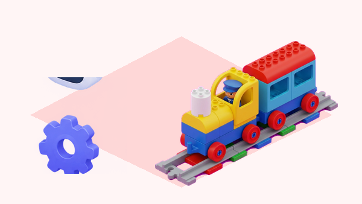

## 🎯 Repte i objectius

Convertiu una via curta en una història amb senyals. Abans de cada prova, l’equip predirà què farà el tren quan passe per un maó d’acció; després observarà la resposta i contrastarà la predicció. L’objectiu és aprendre les funcions que realment té el model de la dotació, sense confondre els maons d’acció amb sensors ambientals.

- Identificar els maons d’acció disponibles i associar color amb resposta observada.
- Ordenar els esdeveniments d’un trajecte i explicar-ne la relació de causa i efecte.
- Distingir les funcions verificades de les que poden variar segons la versió del tren o del kit.

## 🧰 Materials i preparació

- Locomotora Coding Express i vies DUPLO del centre.
- Maons d’acció de colors disponibles: roig, groc, blau, blanc i verd si formen part del kit.
- Una via recta amb espai suficient abans i després de cada maó; estació o túnel de joguet opcional.
- Targetes de colors, full de registre amb columnes «predicció», «resposta observada» i «repetició», i llapis.

Comproveu que el tren està carregat o té piles en bon estat i que les vies estan ben unides. Feu una prova per maó, en una zona lliure. La documentació LEGO confirma el roig per aturar, el groc i el blau per a respostes sonores, i el blanc per encendre o apagar la llum del tren; verifiqueu la resposta del vostre model abans d’ensenyar-la com a regla universal.

## 🧩 Funcions del robot treballades

- Motorització i lectura dels maons d’acció que passen sota el tren.
- Maó roig: ordre d’aturada del tren.
- Maons groc i blau: sons associats al tren, que cal escoltar i descriure en el model disponible.
- Maó blanc: encén o apaga la llum del tren segons la lliçó oficial.
- Maó verd: pot ajudar el tren a tornar cap a l’estació; el recorregut resultant depén de la via i cal provar-lo.

## 👣 Seqüència guiada

### 1. Prepareu la predicció

Poseu un únic maó d’acció en un tram recte i deixeu espai lliure després. Mostreu el color sense explicar-ne la resposta. Cada equip tria una predicció —aturar-se, fer un so, canviar la llum o una altra— i la representa amb una targeta o un dibuix.

### 2. Proveu el roig i els sons

Feu passar el tren pel maó roig i anoteu si s’atura. Després, repetiu amb el groc i el blau per separat. Descriviu els sons que sentiu amb paraules pròpies o pictogrames; no cal imitar exactament un xiulet o un so de càrrega si la resposta del model és diferent. Torneu a provar cada color per comprovar que el resultat es repeteix.

### 3. Investigueu el maó blanc

Observeu primer si la llum del tren està encesa. Col·loqueu el maó blanc i registreu si la llum canvia d’estat. Repetiu-lo una vegada més i compteu quantes vegades passa el tren pel maó. Aquesta prova ajuda a descobrir si la resposta alterna en cada pas.

### 4. Exploreu el maó verd amb una ruta

Si el vostre kit inclou el maó verd, dissenyeu un recorregut amb estació i punt de retorn. Feu una predicció, proveu el maó i observeu com afecta el trajecte. Canvieu la posició del maó només després d’aturar el tren. Registreu la resposta sense afirmar que sempre inverteix el motor: la guia oficial el presenta com una ajuda per tornar i el comportament observat depén de la disposició de la via.

## 🧪 Prova, depura i reflexiona

Completeu una taula per als colors que tingueu. Si una prova no coincideix amb la predicció, comproveu que el maó està centrat i que el tren hi ha passat correctament; repetiu-la abans de canviar res. Separeu clarament allò que diu la documentació oficial d’allò que heu observat amb el tren concret de l’aula.

### Preguntes per comprovar

- Quins colors han fet que el tren s’ature, emeta un so o canvie la llum?
- Quina resposta s’ha mantingut igual en les repeticions?
- Què ha passat amb el maó verd en la nostra via? Quina part de la configuració podria canviar el resultat?
- El tren ha detectat un obstacle o ha respost a una ordre codificada en un maó d’acció?

## ♿ Accessibilitat i seguretat

Prepareu una targeta de predicció per color amb icones grans. L’alumnat pot anticipar la resposta sense manipular el tren i registrar-la amb veu, dibuix o selecció de pictogrames. Manteniu el volum moderat, feu la prova sobre una via estable i atureu el tren abans de canviar els maons.

## ✅ Evidències d’aprenentatge

- Taula amb color, predicció i resposta real observada.
- Seqüència dibuixada que mostra l’ordre dels maons al llarg de la ruta.
- Explicació de la diferència entre una ordre del maó d’acció i un sensor que detectaria l’entorn.
- Nota de qualsevol diferència entre el model físic de l’aula i la descripció de la font oficial.

## 🔗 Fonts oficials i límits

La lliçó [Train Sound de LEGO Education](https://education.lego.com/en-us/lessons/preschool-coding-express/train-sound/) descriu els maons groc i blau associats a sons i explica que el blanc encén i apaga la llum del tren. [First Trip](https://education.lego.com/en-us/lessons/preschool-coding-express/first-trip/) mostra el maó roig com una manera d’aturar-lo i suggereix investigar el verd per ajudar el tren a tornar a l’estació. Aquests maons són marcadors d’acció llegits pel tren; no són sensors de distància, color de l’entorn o obstacles.
