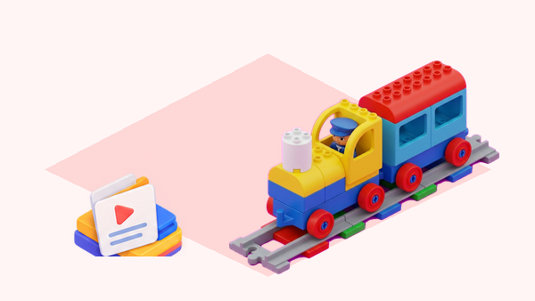

## 🎯 Repte i objectius

Prepareu un primer viatge entre una estació i una destinació. L’equip haurà d’engegar la locomotora, posar-la en marxa amb una empenta suau i decidir com aturar-la de manera controlada. En acabar, podreu explicar què fa el tren i quines decisions depenen de les persones que preparen la via.

- Identificar l’encesa i la resposta de moviment del tren disponible.
- Construir una via connectada i provar el recorregut sense forçar les peces.
- Distingir l’impuls inicial, el moviment motoritzat i les maneres d’aturar el tren.

## 🧰 Materials i preparació

- Locomotora Coding Express del kit de la classe, amb piles o bateria carregada segons el model.
- Vies rectes i corbes suficients per crear un recorregut senzill amb inici i final identificables.
- Una estació i una destinació construïdes amb peces DUPLO, més una figura que represente la passatgera.
- Targetes o pictogrames per marcar inici, trajecte i final; llapis i full per dibuixar la predicció.

Abans de començar, reviseu les unions de la via, retireu obstacles i localitzeu el comandament d’encesa del model concret. La forma i la posició del control poden variar entre versions; seguiu les indicacions impreses del vostre tren i no forceu cap peça.

## 🧩 Funcions del robot treballades

- Encesa i indicadors visibles del tren, que cal observar en el model físic.
- Moviment Push & Go: una empenta posa en marxa el tren motoritzat.
- Aturada manual i aturada mitjançant un maó roig quan el kit el reconeix.
- Desplaçament sobre vies DUPLO; el tren no tria una destinació ni mesura per si mateix la distància recorreguda.

## 👣 Seqüència guiada

### 1. Llegiu el tren abans d’engegar-lo

Col·loqueu la locomotora sobre una superfície plana, al costat de la via. En grup, localitzeu el control d’encesa sense prémer altres peces i observeu quins indicadors lluminosos o sonors apareixen. Anoteu què heu vist; si el tren no respon, comproveu piles o càrrega i demaneu suport abans de continuar.

### 2. Construïu i reviseu el trajecte

Dibuixeu una ruta curta entre l’estació i la destinació, amb un inici i un final clars. Munteu-la amb les peces disponibles i passeu un dit per les unions per comprovar que encaixen. Poseu el tren a la via i, encara sense activar-lo, prediu per on circularà i on voleu aturar-lo.

### 3. Proveu Push & Go i l’aturada manual

Activeu el tren segons el seu model i doneu-li una empenta curta i suau en el sentit de la via. Observeu si continua avançant amb el motor. Quan arribeu a una zona lliure, atureu-lo amb la mà de la manera indicada pel fabricant. Repetiu-ho dues vegades, canviant només la força de l’empenta, i compareu el resultat.

### 4. Compareu amb un maó d’acció roig

Si el kit inclou el maó roig, col·loqueu-lo sobre un tram recte abans de la destinació i feu una predicció. Executeu la ruta a baixa velocitat i comproveu si el tren s’atura en passar-hi. Si no ho fa, reviseu l’orientació i la posició del maó, l’estat de la via i el model de tren; registreu el resultat real sense donar per feta una resposta que no heu observat.

## 🧪 Prova, depura i reflexiona

Feu tres proves i registreu per a cadascuna el tipus d’inici, la manera d’aturada i el resultat. Si el tren s’atura abans o després del punt previst, canvieu una sola cosa cada vegada: empenta inicial, unió de via o posició del maó. No empenyeu la locomotora mentre el motor funciona.

### Preguntes per comprovar

- Què hem fet perquè el tren comence a avançar?
- Quina diferència hem observat entre aturar-lo amb la mà i fer servir el maó roig?
- Quina prova ha sigut més repetible? Quines condicions hem mantingut iguals?
- El tren sap quin lloc és l’estació o ho hem representat nosaltres amb la via i les peces?

## ♿ Accessibilitat i seguretat

Assigneu rols rotatius: muntar la via, comprovar unions, donar la instrucció d’inici i registrar el resultat. Qui no vulga tocar el tren pot predir el recorregut, assenyalar pictogrames o fer el registre. Feu servir una ruta curta, manteniu-la lluny de vores i cabells, i atureu el tren abans de moure vies o maons.

## ✅ Evidències d’aprenentatge

- Dibuix del recorregut amb inici, destinació i punt d’aturada.
- Registre de tres proves que indique com s’ha iniciat i aturat el tren.
- Explicació oral, escrita o amb pictogrames de la diferència entre Push & Go i una ordre de programa digital.

## 🔗 Fonts oficials i límits

La lliçó oficial [First Trip de LEGO Education](https://education.lego.com/en-us/lessons/preschool-coding-express/first-trip/) presenta l’ús dels maons d’acció i diverses formes d’aturar el tren. Aquesta guia és una adaptació pròpia per a la dotació del centre: localitzeu el control d’encesa segons el model i comproveu-ne la resposta física. Push & Go no equival a una seqüència de codi, i el tren no incorpora detecció de destinació ni mesura de distància.
