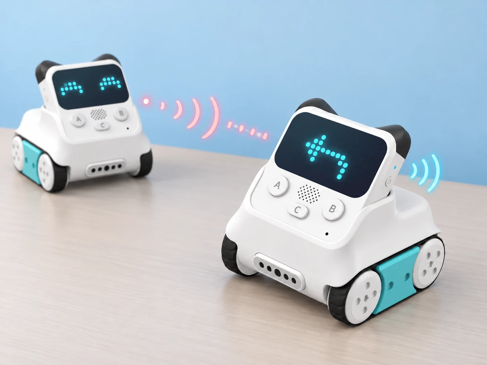

## 🎯 Repte i objectius

Prepareu un comandament gestual que mostre un senyal visual i sonor, i envieu una ordre senzilla a un segon Codey Rocky mitjançant l’infraroig. El repte combina giroscopi/acceleròmetre, potenciòmetre, altaveu i transmissor/receptor IR. La comunicació IR necessita dos dispositius compatibles, orientació adequada i absència d’obstacles opacs entre els sensors.

## 🧰 Materials i preparació

- Dos Codey Rocky de la dotació, si es vol provar transmissió entre robots; amb un sol kit, la comunicació IR es pot simular amb targetes.
- mBlock 5 i connexió USB o Bluetooth admesa pel dispositiu.
- Una superfície plana i una marca per definir l’orientació inicial.
- Targetes amb les ordres fictícies «endavant», «aturar» i «gir».

Comproveu al mBlock instal·lat que els blocs de potenciòmetre, orientació/gest i infraroig apareixen per al dispositiu Codey. Les extensions i noms de blocs poden variar. Si un bloc no apareix, documenteu la funció com a no disponible en aquella versió; no el substituïu per una funció de Neuron o d’un altre robot.

## 🧩 Funcions del robot treballades

- Potenciòmetre/gear knob per llegir una entrada variable física.
- Connexió Bluetooth a l’app Makeblock per al control Drive i el traçat Draw & Run, quan l’app és compatible i està disponible.
- Giroscopi i acceleròmetre de sis eixos per detectar inclinació, gir o sacsejada.
- Altaveu i matriu LED de Codey com a eixides.
- Emissor i receptor d’infraroig per enviar/recollir un codi entre Codey Rocky compatibles.

## 👣 Seqüència guiada

### 1. Proveu el control manual de l’app

Si l’app Makeblock està disponible en el dispositiu del centre, connecteu Codey Rocky per Bluetooth i proveu les funcions Drive i Draw & Run documentades pel fabricant. Feu una ruta curta, observeu com canvia la matriu i atureu el robot abans de canviar de mode. Si l’app no és compatible amb el dispositiu actual, planifiqueu la mateixa ruta amb targetes i anoteu que és una alternativa desconnectada.

### 2. Llegiu el potenciòmetre

Mostreu a la pantalla el valor del gear knob i gireu-lo lentament d’un extrem a l’altre. Anoteu tres posicions (mínima, central i màxima) sense donar per fet un interval numèric concret. Feu que el valor trie entre tres icones o colors del LED RGB. Comproveu que cada posició repetida produeix una resposta coherent.

### 3. Calibreu un gest amb la placa estable

Definiu l’orientació inicial sobre una superfície plana i mostreu una fletxa per a una inclinació a l’esquerra, una a la dreta i una posició neutra. Separeu els gestos de sacsejada de les lectures d’angle: una sacsejada és un esdeveniment ràpid, mentre que el giroscopi/acceleròmetre també permet observar canvis d’orientació. Proveu cada acció tres vegades sense aixecar la placa per damunt de la zona de treball.

### 4. Afegiu resposta visual i sonora

Quan es detecte un gest triat, mostreu una icona i feu sonar un to breu amb l’altaveu. Afegiu una pausa perquè el senyal no es repetisca contínuament mentre el robot continua inclinat. Oferiu una resposta només visual si el so no és adequat a l’aula.

### 5. Envieu un senyal infraroig

Amb dos Codey Rocky, programeu el primer per enviar un dels codis de prova quan es detecte una inclinació o una posició del potenciòmetre. Configureu el segon perquè només quan rep el codi corresponent mostre la icona prevista; no activeu moviments motors en aquesta primera prova. Col·loqueu els robots encarats, a poca distància, i després canvieu l’angle o interposeu una cartolina per observar la pèrdua de senyal. Si només hi ha un robot, feu l’esquema emissor–canal–receptor amb targetes i marqueu-lo com a simulació.

_Els senyals representen una comunicació IR senzilla entre dispositius; no és Wi-Fi ni una connexió privada._

## 🧪 Prova, depura i reflexiona

Registreu tres valors del potenciòmetre, tres intents per a cada gest i cinc missatges IR enviats. Proveu el receptor amb codi correcte, codi diferent, robots girats i línia de visió tapada. Anoteu recepcions esperades i observades. No canvieu simultàniament distància, angle i codi; varieu-ne un cada vegada per identificar la causa d’un error.

### Preguntes per comprovar

- Quin component produeix cada lectura i quin programa transforma la lectura en una resposta?
- Quina diferència hi ha entre el valor del potenciòmetre i una inclinació del robot?
- En quines condicions s’ha rebut el missatge IR amb més fiabilitat?
- Què hauria de fer el programa si no arriba cap missatge?

## ♿ Accessibilitat i seguretat

La inclinació i la sacsejada són opcions; permeteu introduir el mateix codi amb botons, potenciòmetre o targetes. Manteniu els robots quiets durant les proves de recepció i no els feu córrer cap a persones. El so és breu i opcional, amb senyal visual equivalent. No envieu missatges personals.

## ✅ Evidències d’aprenentatge

Conserveu els programes emissor i receptor, la taula de gestos i potenciòmetre, els cinc casos de comunicació i un esquema que identifique transmissió IR i resposta del receptor. Indiqueu quines proves s’han fet amb maquinari i quines s’han simulat.

## 🔗 Fonts oficials i límits

La pàgina oficial [About Codey Rocky](https://support.makeblock.com/hc/en-us/articles/1500004392242-About-Codey-Rocky) identifica el potenciòmetre, giroscopi, acceleròmetre, emissor/receptor IR, altaveu, matriu i indicador RGB. La guia de [control amb l’app Makeblock](https://support.makeblock.com/hc/en-us/articles/1500008637181-Control-Codey-Rocky-with-the-Makeblock-app), el [catàleg de casos de Codey Rocky](https://support.makeblock.com/hc/en-us/sections/360001829193-Codey-Rocky) i la guia de [programació amb mBlock 5](https://support.makeblock.com/hc/en-us/articles/1500008637961-Program-Codey-Rocky-with-mBlock-5) depenen de la versió de l’app i del programari. Makeblock aclareix a les [FAQ](https://support.makeblock.com/hc/en-us/articles/1500004266501-FAQs-on-Codey-Rocky) que Codey Rocky no té reconeixement de parla incorporat; les guies d’aquesta col·lecció que usen veu en línia o extensions ho indiquen com a dependència externa.
