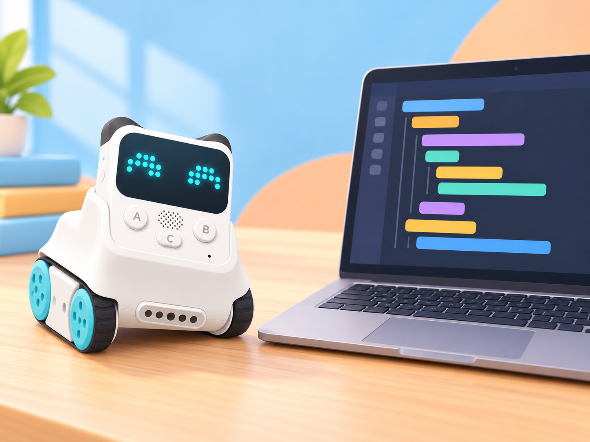

## 🎯 Repte i objectius

Feu que Codey Rocky mostre una cara en prémer A i una altra en prémer B, carregueu el programa al controlador Codey i compareu els blocs amb la traducció Python que genera mBlock 5. Així practicareu la sintaxi amb una acció visible, sense confondre el codi per a Codey Rocky amb Python genèric ni amb el programa del xassís Rocky.

- Connectar Codey a mBlock 5 i seleccionar el dispositiu correcte.
- Distingir l’execució Live de la càrrega Upload.
- Crear dos esdeveniments de botó amb blocs i executar-los sense connexió permanent.
- En mode Upload, obrir la vista Python generada pels blocs i identificar imports, esdeveniments i instruccions del dispositiu.
- Canviar una acció i comprovar el resultat amb el robot.

## 🧰 Materials i preparació

- Codey Rocky de la dotació, carregat i amb el controlador ben acoblat al xassís.
- mBlock 5 per a ordinador i cable micro-USB de la dotació.
- Superfície plana, amb espai lliure al voltant de Rocky; es pot elevar el xassís perquè les erugues no el desplacen durant la primera comprovació.
- Targetes A/B amb les dues expressions que mostrarà la matriu 16 × 8.

Obriu mBlock, afegiu el dispositiu «Codey» de la biblioteca i connecteu-lo per USB. En mode Upload, comproveu primer que el programa de blocs funciona abans d’obrir la vista Python. Segons l’edició i versió de mBlock, l’etiqueta o la posició de l’opció Python pot canviar; si no apareix, actualitzeu el programari del centre segons les instruccions oficials o feu l’exercici amb la traducció de blocs que sí que es mostre.

## 🧩 Funcions del robot treballades

- Programació de Codey Rocky amb blocs i Python a mBlock 5.
- Botons A i B del controlador Codey com a entrades i matriu LED 16 × 8 com a eixida.
- Mode Live per a executar mentre Codey continua connectat i mode Upload per a transferir el programa al controlador.
- Vista de codi Python generat pels blocs i ús de biblioteques pròpies de Codey/Rocky.

## 👣 Seqüència guiada

### 1. Connecteu el dispositiu Codey

Useu el cable micro-USB per a connectar Codey a l’ordinador i enceneu-lo. A mBlock 5, afegiu «Codey» i completeu la connexió. Confirmeu que l’estat és connectat abans de crear el programa. Si useu la versió web, seguiu el mètode de connexió i el controlador mLink que indique la instal·lació del centre.

### 2. Creeu el programa amb blocs

En mode Upload, creeu un esdeveniment «quan es prema el botó A» i afegiu una imatge a la pantalla. Creeu un segon esdeveniment per al botó B amb una imatge diferent. Proveu primer les dues condicions i observeu els indicadors de càrrega; no poseu ordres de moviment motor en aquesta primera pràctica.

### 3. Carregueu i comproveu el programa

Seleccioneu Upload i transferiu el projecte a Codey. Quan la càrrega acabe, desconnecteu el cable només si el programa ja s’ha transferit i proveu A i B. El programa carregat continua funcionant sense connexió a mBlock. En Live, en canvi, el controlador ha de mantindre la connexió amb l’ordinador perquè les ordres s’executen en temps real.

_La imatge mostra el model Codey Rocky de la dotació. La interfície és una representació visual; el codi concret es genera des de mBlock 5._

### 4. Obriu la vista Python generada

Torneu a connectar Codey, obriu el mateix projecte en mode Upload i activeu l’opció per canviar entre blocs i Python. Localitzeu els imports de les biblioteques Codey/Rocky, les dues funcions d’esdeveniment i les instruccions que mostren les imatges. No copieu aquesta traducció com si fora Python estàndard: depén de les biblioteques i de l’entorn mBlock.

### 5. Modifiqueu una instrucció i torneu-la a provar

Canvieu una de les imatges des de l’editor Python si la vostra versió permet editar el codi, o torneu a la vista de blocs i canvieu el dibuix allí. Carregueu una altra vegada el programa i proveu el botó afectat. Compareu el canvi fet al programa amb la resposta de la matriu; no modifiqueu les dues ordres alhora.

## 🧪 Prova, depura i reflexiona

Feu una prova en Live i una altra en Upload. En cada cas, registreu si Codey continua connectat, què passa en prémer A i B i si el programa segueix funcionant després de desconnectar el cable. Si Python no apareix, comproveu primer que heu seleccionat Codey, que esteu en Upload i que la versió de mBlock ofereix la vista de codi per a aquest dispositiu.

### Preguntes per comprovar

- Quina diferència pràctica hi ha entre Live i Upload?
- Quines línies Python corresponen als botons A i B?
- Què aporten els imports de les biblioteques Codey i Rocky?
- Per què un programa carregat continua funcionant quan desconnectem el cable?
- Quina única instrucció heu canviat i quina prova mostra l’efecte?

## ♿ Accessibilitat i seguretat

Oferiu una versió impresa dels blocs i de la vista Python, amb colors o marques que connecten cada esdeveniment amb la instrucció equivalent. Una persona pot llegir el codi i una altra provar els botons. Manteniu el robot quiet mentre feu les primeres proves; abans d’afegir motors, deixeu lliure la zona i tingueu a mà l’aturada del programa.

## ✅ Evidències d’aprenentatge

Deseu el projecte de blocs, una captura o transcripció de la vista Python, el registre comparatiu Live/Upload i la prova final en A i B. Indiqueu la versió de mBlock, si el codi Python s’ha pogut editar directament i si el programa s’ha provat amb maquinari o només en la vista de codi.

## 🔗 Fonts oficials i límits

La guia oficial de Makeblock [Program Codey Rocky with mBlock 5](https://support.makeblock.com/hc/en-us/articles/1500008637961-Program-Codey-Rocky-with-mBlock-5) confirma els modes Live/Upload i que, en Upload, es pot canviar entre blocs i Python o veure el codi corresponent. La documentació de [transcodificació d’Upload](https://support.makeblock.com/hc/en-us/articles/15236617061783-Configuration-Transcoding-Setting-for-the-Upload-Mode) mostra les biblioteques `codey` i `rocky`. Les opcions de vista i edició depenen de la versió instal·lada; la guia no pressuposa una API manual estable ni una connexió a Internet durant l’execució carregada.
