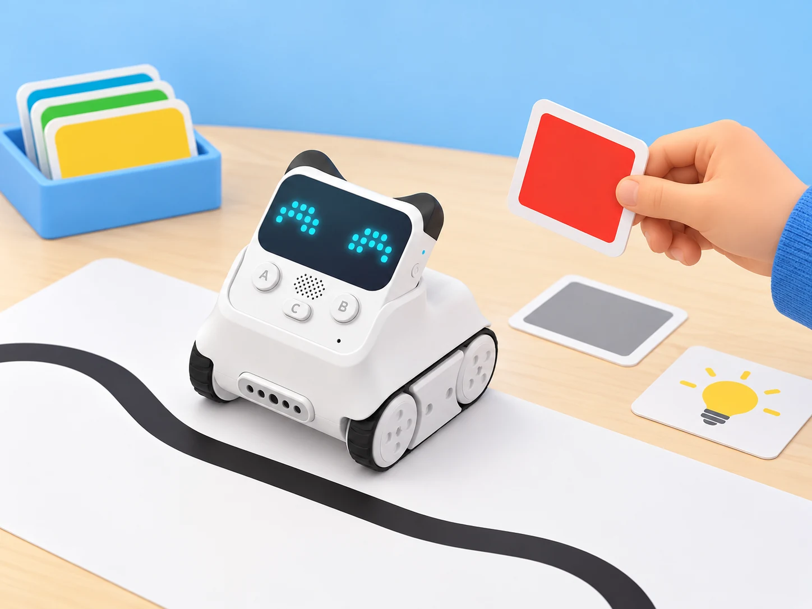

## 🎯 Repte i objectius

Dissenyeu una estació de senyalització que reaccione a la llum i al so, i feu que Rocky seguisca una línia de prova. El repte és identificar quina entrada canvia, quina eixida respon i quines condicions fan que la lectura falle. No mesureu ni classifiqueu el soroll de persones: utilitzeu sons breus creats voluntàriament per l’equip o targetes de valors simulats.

## 🧰 Materials i preparació

- Codey Rocky de la dotació, carregat i muntat correctament.
- Ordinador amb una versió compatible de mBlock 5 i l’extensió/dispositiu Codey.
- Cartolines clara, fosca i de colors; una tira negra ampla sobre fons blanc.
- Un llum d’aula regulable o una caixa de cartó oberta per variar la il·luminació.
- Targetes de prova amb condicions de llum, so i color; les dades poden ser simulades.

Abans de començar, comproveu que el robot es connecta, que les erugues es mouen lliurement i que el sensor infraroig/color no està tapat. Els noms dels blocs poden variar amb la versió de mBlock i del firmware; no substituïu la lectura del sensor per una afirmació de distància o color exacte si l’aplicació no la proporciona.

## 🧩 Funcions del robot treballades

- Sensor de llum ambiental i indicador RGB programable del mòdul Codey.
- Sensor de so ambiental: detecta intensitat/llindar de so, no paraules ni identitat de qui parla.
- Sensor infraroig/color de Rocky i motors de les erugues per provar una ruta amb línia i targetes.
- Condicionals i ajust de llindars a mBlock 5; el sensor reflectit depén del material, la distància i l’angle.

## 👣 Seqüència guiada

### 1. Comprovem les entrades i eixides

Obriu mBlock 5, seleccioneu Codey Rocky i executeu una seqüència curta que mostre un color a l’indicador RGB i faça avançar Rocky a baixa velocitat durant un interval breu. Atureu el programa i verifiqueu que el botó d’aturada del projecte respon. Anoteu quins elements són entrades (llum, so i reflexió infraroja) i quins són eixides (RGB i motors).

### 2. Calibrem llum i color

Manteniu Codey en la mateixa orientació i registreu diverses lectures en llum habitual i en una zona més ombrejada. Trieu un llindar entre els valors observats, si les mostres se separen, i feu que l’indicador RGB canvie de color segons la condició. Després compareu una targeta clara, una fosca i dues de colors a la mateixa distància. Registreu què detecta realment el bloc; no suposeu que tots els colors es distingeixen amb la mateixa fiabilitat.

### 3. Proveu el sensor de so amb una entrada controlada

Registreu primer el valor en silenci i després feu tres sons breus i voluntaris a una distància fixa (per exemple, picar de mans suaument). Configureu un llindar a partir de les lectures, feu que l’indicador RGB done un senyal visual i afegiu una pausa perquè no es dispare repetidament. El sensor no reconeix instruccions parlades: si no hi ha una lectura estable, substituïu aquesta part per una taula de valors simulats.

### 4. Seguiu una línia i depureu la ruta

Col·loqueu Rocky sobre una pista ampla, plana i sense desnivells. Proveu primer el sensor infraroig/color damunt del fons clar i després sobre la línia fosca; anoteu les lectures o estats que expose el bloc disponible. Construïu una correcció lenta: quan detecte la línia, ajusteu els motors perquè el robot torne al centre; quan no la detecte, corregiu cap a l’altre costat. Si el bloc de la vostra versió només ofereix una ordre de seguiment predefinida, feu-la servir i compareu la ruta amb els mateixos criteris, sense inventar una lectura numèrica.

_Les targetes i la línia són materials de prova; els resultats depenen del sensor, la superfície, la llum i la versió de mBlock._

## 🧪 Prova, depura i reflexiona

Registreu una taula amb condició, lectura/estat, eixida esperada, eixida observada i incidència. Repetiu tres vegades cada prova: llum clara, ombra, so per davall del llindar, so per damunt, targeta fosca, targeta de color i tres trams de pista amb línia. Canvieu només un factor cada vegada. Si els resultats no són repetibles, ajusteu el llindar o l’alineació del sensor; no presenteu una lectura inestable com una mesura exacta.

### Preguntes per comprovar

- Quina entrada concreta activa cada canvi de color o moviment?
- El sensor de so reconeix paraules o només una variació de nivell sonor?
- Quina targeta ha donat una lectura més difícil de distingir? Quina variable podria explicar-ho?
- El robot segueix la línia millor després d’ajustar la velocitat o la posició del sensor?

## ♿ Accessibilitat i seguretat

Manteniu el robot a velocitat baixa i dins d’un recorregut delimitat, lluny de vores i dits. No useu sons forts, no enregistreu veus i no feu inferències sobre les persones a partir del nivell de so. Oferiu lectures simulades o targetes impreses a qui no vulga participar en una prova sonora; es poden comparar resultats sense conduir el robot.

## ✅ Evidències d’aprenentatge

Conserveu el projecte mBlock, l’esquema entrada–procés–eixida, la taula de proves repetides i una nota sobre el llindar triat i les limitacions del sensor. La verificació del fabricant identifica el sensor de llum, el sensor de veu/so, els botons i l’indicador RGB de Codey, i les funcions de color, obstacle i seguiment de Rocky; la pràctica només afirma les funcions que s’han comprovat en la unitat del centre.

## 🔗 Fonts oficials i límits

[Makeblock · About Codey Rocky](https://support.makeblock.com/hc/en-us/articles/1500004392242-About-Codey-Rocky) descriu els elements de Codey i Rocky. [Makeblock · Programming Codey Rocky with mBlock 5](https://support.makeblock.com/hc/en-us/articles/1500004392242-About-Codey-Rocky) és el punt de partida per a la connexió; comproveu la compatibilitat del sistema i l’extensió instal·lada. La detecció de so no és reconeixement de parla, i el sensor infraroig/color no és una càmera ni un dispositiu de mesura universal.
