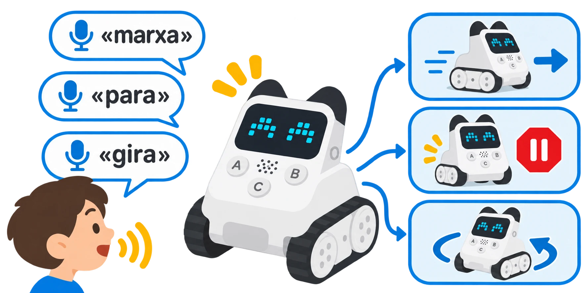

## 🎯 Què aprendrem?

Compareu què passa quan Codey sent una palmada i què caldria perquè interpretara una paraula. El robot pot indicar si un so és més fort o més fluix, però no inclou un mòdul que reconega paraules.

- Comparar una lectura de so ambiental amb una ordre de veu interpretada per programari.
- Comprovar si l’extensió de serveis cognitius està disponible abans d’utilitzar-la.
- Vincular una entrada de prova a una resposta visible i segura, sense activar moviments inesperats.
- Identificar quan una prova necessita un servei de veu extern.



## 🧰 Materials i preparació

- Codey Rocky de la dotació amb bateria suficient i espai de treball delimitat.
- Ordinador amb mBlock 5, micròfon del dispositiu i connexió de xarxa només si el servei en línia està autoritzat.
- Targetes grans amb les ordres fictícies «marxa», «para» i «gira» per a una simulació sense veu.
- Un registre per anotar component, programa, resposta i dependències de cada prova.

Comenceu amb el sensor de so de Codey. La prova de paraules és opcional i només es fa si el centre disposa d’un servei compatible i n’autoritza l’ús; si no, useu les targetes.

## 🧩 Funcions i controls

- Sensor de so integrat de Codey: permet llegir intensitat sonora i fer que una condició responga a un llindar; no transcriu ni entén paraules.
- Pantalla LED, indicador RGB i altaveu com a eixides per comunicar un estat de prova.
- Reconeixement de parla com a funció de programari o mòdul Neuron compatible, no com a sensor integrat del Codey Rocky base.
- Connexió i serveis en línia com a dependències externes que poden no estar disponibles o tindre límits d’idioma i compte.

## 👣 Pas a pas

### 1. Mesureu el so amb el robot base

Connecteu Codey a mBlock i busqueu el bloc que llig el nivell de so. Prepareu un programa que el mostre contínuament a la pantalla. Aquesta representació us ajuda a trobar els blocs equivalents en la vostra versió:

```mblock
quan comença el programa
per sempre
mostra el nivell de so
fi
```

Carregueu o executeu el programa segons el mode triat. Anoteu què mostra en silenci i després amb una palmada suau; repetiu tres vegades. El número ajuda a comparar sons: no és una mesura de decibels ni una paraula reconeguda.

### 2. Comproveu i, si podeu, proveu el servei de veu

Comproveu si disposeu d’una extensió o d’un servei de reconeixement de parla compatible. Anoteu-ne el nom i la llengua disponible abans d’activar el micròfon. Si el servei funciona i està autoritzat, proveu una frase fictícia i feu que aparega una icona quan coincidisca amb la paraula prevista; proveu també una frase diferent i el silenci. Manteniu els motors aturats. Una lectura de so alt no significa que Codey haja entés una paraula.

### 3. Simuleu les ordres si no hi ha servei

Una persona tria una targeta —«marxa», «para» o «gira»— i una altra mostra la icona acordada. Anoteu el resultat com a **simulació**: aquesta prova ajuda a preparar la prova, però no comprova que el robot reconega la veu.

_Il·lustració decorativa: el símbol no representa un servei concret. El robot base no incorpora reconeixement de parla._

## 🧪 Comprovació i resolució de problemes

Comproveu per separat la lectura del sensor de so i la resposta de l’extensió externa. Si el servei de veu no està disponible, podeu provar la resposta del programa amb una entrada de text fictici; això no comprova reconeixement de parla. Manteniu els motors aturats.

## 🛡️ Ús i seguretat

Useu paraules fictícies o text de prova, sense dades personals. Manteniu els motors desactivats durant les proves de veu. Abans d’activar un servei extern, comproveu si envia àudio fora del dispositiu i reviseu-ne les condicions de privacitat.

## 🔗 Fonts i límits

Makeblock descriu el [sensor de so integrat de Codey Rocky](https://support.makeblock.com/hc/en-us/articles/1500004392242-About-Codey-Rocky) com una lectura del nivell sonor, i a les [FAQ oficials](https://support.makeblock.com/hc/en-us/articles/1500004266501-FAQs-on-Codey-Rocky) indica que el model base no té un mòdul de reconeixement de parla; la veu requeriria un mòdul Neuron compatible. La [guia oficial del cas de veu](https://support.makeblock.com/hc/en-us/articles/7463171094295-Case-11-Voice-activated-RGB-LED-indicator) treballa el nivell de so, no la transcripció de paraules. Les extensions d’IA i els serveis en línia depenen de la versió i de la xarxa disponible.
