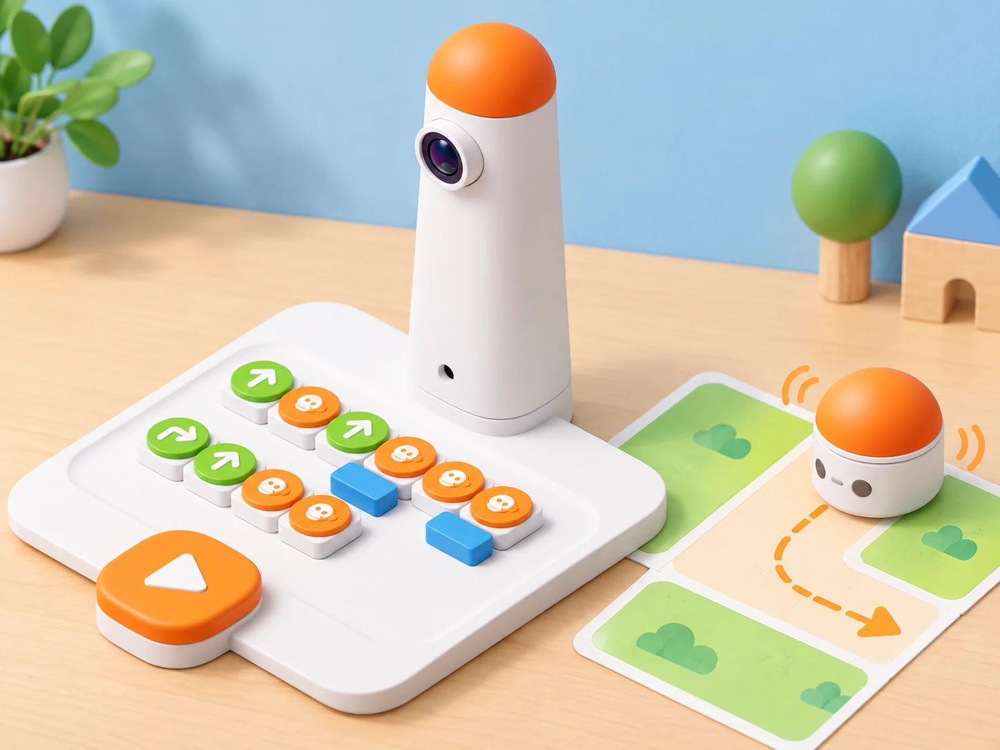

## 🎯 Repte i objectius

Reduïu una ruta llarga a un programa més curt reutilitzant una funció i acabeu amb una sortida creativa del MatataBot. Aprendreu a distingir una funció definida per l’equip dels blocs divertits preprogramats. El Coding Set base inclou funcions i blocs de moviment aleatori/música/dansa; compondre melodies amb notes pertany al complement Musician.

## 🧰 Materials i preparació

- Matatalab Coding Set complet: torre de control, tauler, MatataBot i blocs de moviment, funció, bucle, número i diversió.
- Mapa o graella plana amb una ruta senzilla.
- Full per anotar la seqüència i comptar els blocs utilitzats.

Carregueu torre i robot, col·loqueu la torre estable davant del tauler i confirmeu la connexió abans de prémer Play. Separeu qualsevol bloc del Sensor Add-on o del Musician Add-on: no és necessari ni forma part de les funcions base tractades ací.

## 🧩 Funcions del robot treballades

- Blocs físics Define Function i Call Function per definir i reutilitzar una seqüència.
- Lectura del programa pel Control Tower i transmissió al MatataBot.
- Blocs divertits predefinits: moviment aleatori, música i dansa.
- Blocs numèrics associats a ordres compatibles, incloses les funcions de diversió documentades pel fabricant.

## 👣 Seqüència guiada

### 1. Dissenyeu una seqüència que es repetisca

Planifiqueu una ruta amb dues parts: una seqüència curta que aparega dues vegades i un tram final diferent. Dibuixeu-la a la graella i escriviu totes les ordres de moviment en ordre. Compteu els blocs que farien falta si repetíreu la seqüència completa cada vegada.

### 2. Definiu i crideu una funció

Col·loqueu un bloc Call Function a la línia principal i el bloc Define Function a la fila inferior, segons la disposició indicada per Matatalab. Poseu dins de la definició la seqüència que voleu reutilitzar i deixeu la crida a la ruta. Les peces Define i Call s’utilitzen en parella; no afegiu un bloc número a la funció, ja que aquesta combinació no és compatible segons la guia oficial. Feu que la torre llig el programa i executeu-lo a baixa velocitat.

### 3. Compareu els blocs divertits

Proveu, separadament, el bloc de moviment aleatori, el de música predefinida i el de dansa predefinida. Abans de cada intent, feu una predicció i marqueu què no controla l’alumnat: el robot selecciona un comportament incorporat, no una seqüència detallada que haja programat la classe. Si combineu un bloc número amb un bloc divertit, observeu la selecció que indica la documentació del fabricant i no n’inferiu una cançó concreta sense comprovar-la.

### 4. Depureu la lectura del tauler

Canvieu una sola peça de la funció o de la ruta i torneu a executar. Si el MatataBot no fa la ruta esperada, comproveu ordre de lectura, orientació de les peces, posició de Define/Call i connexió de la torre. Registreu quin canvi ha resolt l’error; no mogueu peces mentre la torre està llegint.

_La imatge representa el Control Tower i el robot del Coding Set; els símbols del mapa són decoratius i no codis oficials._

## 🧪 Prova, depura i reflexiona

Executeu tres vegades la ruta amb totes les ordres escrites i tres vegades amb funció. Anoteu blocs utilitzats, destinació i errors. Després feu tres proves de cadascun dels blocs divertits i marqueu si el resultat és determinista o aleatori/predefinit. Si una execució falla, confirmeu primer el muntatge del tauler abans de reescriure el programa.

### Preguntes per comprovar

- Quines ordres formen la funció i quantes vegades es crida?
- Quina posició física han d’ocupar Define Function i Call Function?
- Quina diferència hi ha entre una funció creada per vosaltres i una dansa predefinida?
- Quin complement caldria per compondre una melodia amb notes pròpies?

## ♿ Accessibilitat i seguretat

Permeteu planificar primer amb targetes grans o dir les ordres a una persona que les col·loca. Manteniu la torre i el tauler en una superfície estable, sense peces soltes prop de la trajectòria del robot. Si la música incomoda, silencieu-la o substituïu l’observació sonora per un registre visual del bloc i del moviment.

## ✅ Evidències d’aprenentatge

Guardeu els dos programes comparats, el recompte de peces, les sis execucions de ruta i el registre dels blocs divertits. Expliqueu quina seqüència s’ha creat amb funcions pròpies i quins comportaments venen preprogramats; anoteu explícitament si la caixa del centre inclou algun complement.

## 🔗 Fonts oficials i límits

Les pàgines oficials Matatalab descriuen els [blocs de funció](https://matatalab.com/en/node/63), els [blocs de seqüència i paràmetres](https://matatalab.com/en/node/61) i l’[inventari dels blocs del Coding Set](https://matatalab.com/en/node/60). El [Musician Add-on](https://matatalab.com/en/node/65) és un complement separat per a treballar notes i melodies; el Sensor Add-on també és opcional i no s’utilitza en aquesta guia.
