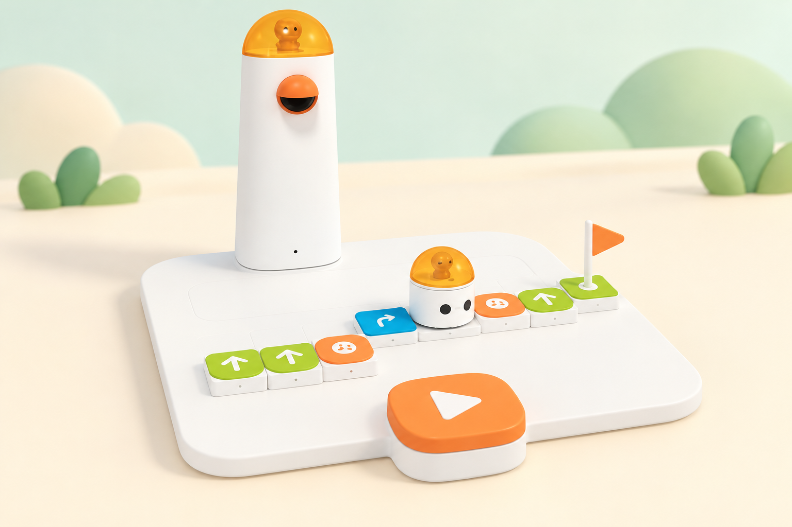

## 🎯 Repte i objectius

Planifiqueu un trajecte perquè MatataBot arribe a una bandera sense travessar cap obstacle. L’objectiu és distingir un obstacle físic —que delimita el mapa— d’un sensor: en aquesta activitat el robot no el detecta ni l’esquiva automàticament. L’alumnat ha de llegir la graella, anticipar els girs i programar una ruta segura amb les fitxes direccionals del Coding Set.

En acabar, cada equip podrà:

- descriure inici, destinació i caselles prohibides;
- construir una seqüència de moviments que evite les peces d’obstacle;
- comprovar si la ruta arriba a la bandera i corregir-la amb una prova cada vegada;
- explicar per què «girar a l’esquerra» no vol dir «desplaçar-se cap a l’esquerra».

## 🧰 Materials i preparació

- Coding Set de la dotació: MatataBot, Control Tower, tauler de control, mapa, fitxes de moviment i bandera.
- Obstacles inclosos amb el conjunt; confirmeu que són les peces del kit base del vostre centre.
- Targetes o quadrícula de paper per a planificar una ruta abans de col·locar les fitxes.
- Registre de predicció, prova i correcció.

Connecteu la torre, el tauler i el robot segons la guia del fabricant. Marqueu una casella d’inici, col·loqueu la bandera en una altra casella i poseu dos obstacles en caselles intermèdies. Manteniu el mapa pla i deixeu lliure l’espai perquè el robot puga avançar sense que les peces es moguen. Aquesta pràctica usa obstacles com a elements del mapa, no els sensors del complement Sensor Add-on.

## 🧩 Funcions del robot treballades

- Lectura del programa físic per la Control Tower i transmissió al MatataBot.
- Ordres direccionals: avançar, retrocedir i girar 90° a dreta o esquerra.
- Bandera com a destinació visible i obstacles físics com a restriccions de la ruta.
- Execució seqüencial i depuració d’un programa tangible.

## 👣 Seqüència guiada

### 1. Llegiu el mapa des del punt de vista del robot

Poseu MatataBot a l’inici i orienteu-lo cap a la primera casella. Identifiqueu la bandera i les caselles ocupades pels obstacles. Dibuixeu la graella en paper i marqueu amb una creu les posicions que el robot no ha de travessar. Abans de programar, feu que cada persona explique cap a on mira el robot: les ordres de gir són relatives a la seua orientació.

### 2. Planifiqueu una ruta amb fletxes

Dibuixeu una ruta que faça una volta al voltant dels obstacles i arribe a la bandera. Escriviu les ordres en una llista; useu «gira» abans de l’ordre d’avançar quan canvie la direcció. Representeu un gir a la dreta com `↻` i un gir a l’esquerra com `↺`; cap dels dos desplaça el robot de casella. Compteu cada avanç segons la quadrícula del mapa i no afegiu peces numèriques si no les necessiteu.

_La il·lustració representa el kit Coding Set de la dotació. Les peces d’obstacle i la bandera delimiten la ruta; no són sensors ni ordres programables._

### 3. Traduïu el pla a fitxes físiques

Col·loqueu les fitxes en l’ordre de lectura del tauler. Reviseu cada moviment assenyalant alhora la fitxa i el tram dibuixat. Un company o companya farà de verificador/a: comprovarà que no hi ha un gir confós amb un moviment lateral i que la seqüència acaba quan MatataBot arriba a la bandera.

### 4. Executeu i observeu el trajecte

Poseu el robot a l’inici amb la mateixa orientació que al dibuix i executeu el programa. No mogueu els obstacles mentre es desplaça. En arribar a la bandera, confirmeu si ha seguit el camí previst; si topa amb una peça o passa de llarg, atureu la prova, localitzeu la primera diferència i torneu al tauler de control.

### 5. Depureu canviant una sola instrucció

Compareu la ruta prevista amb la ruta real i canvieu només la primera fitxa que explique l’error. Torneu a executar i anoteu què ha canviat. Quan funcione, busqueu una segona ruta que arribe a la mateixa bandera amb una seqüència diferent i expliqueu quina és més fàcil de llegir.

## 🧪 Prova, depura i reflexiona

Feu almenys tres execucions: una ruta inicial, una ruta corregida i una alternativa. En cada cas, registreu inici, orientació, obstacles, seqüència de fitxes i resultat. Comproveu també un programa deliberadament invàlid en paper —per exemple, una ruta que travessaria una casella ocupada— i expliqueu per què s’ha de corregir abans d’executar-lo.

### Preguntes per comprovar

- Quines caselles representen restriccions i quina representa la destinació?
- En quin moment un gir canvia l’orientació sense canviar de casella?
- Quin error concret heu trobat i quina única fitxa heu modificat?
- El MatataBot ha detectat l’obstacle o l’hem evitat perquè nosaltres hem planificat la ruta?
- Podeu arribar a la mateixa bandera amb una seqüència diferent?

## ♿ Accessibilitat i seguretat

Es pot fer la planificació amb una quadrícula gran, pictogrames o peces tàctils abans de transferir-la al tauler. Repartiu rols rotatius: cartògraf/a, programador/a, verificador/a i observador/a. Si manipular les peces menudes és difícil, una persona pot dictar la seqüència i una altra col·locar-la. Manteniu dits i cables fora del recorregut del robot; no forceu el moviment ni presenteu la ruta com una detecció automàtica d’obstacles.

## ✅ Evidències d’aprenentatge

Deseu el mapa anotat, la seqüència de fitxes, el registre de les tres proves i una breu explicació de la correcció. La fotografia és opcional; enquadreu només el material i eviteu cares, noms i veus. L’evidència ha de deixar clar quines decisions ha pres l’alumnat i quines accions ha executat el robot.

## 🔗 Fonts oficials i límits

La lliçó oficial [Get to Know Matatalab Coding Set](https://matatalab.com/en/node/60) inclou obstacles i banderes en l’inventari del conjunt; [Hello, Matatalab Robots!](https://matatalab.com/en/node/88) treballa la bandera com a destinació i les ordres de moviment. Aquesta guia adapta aquests elements a un repte propi de planificació i depuració. Les peces físiques no detecten obstacles: la detecció amb fitxes «Obstacle/No Obstacle» pertany al Sensor Add-on, que és un complement diferent.
