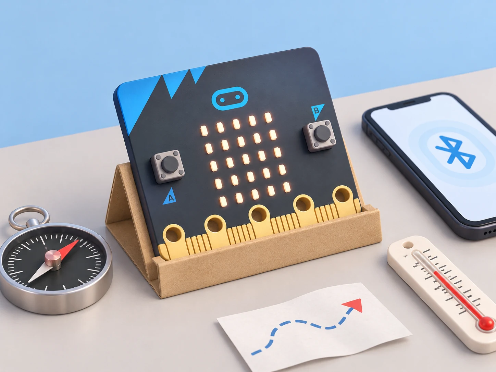

## 🎯 Repte i objectius

Construïu una estació de camp que indique orientació, mostre una lectura tèrmica aproximada i comunique un resultat a un dispositiu connectat. Compareu les dades amb instruments de referència i identifiqueu què canvia entre micro:bit V1 i V2. No useu el prototip per a prendre decisions meteorològiques o de seguretat.

## 🧰 Materials i preparació

- Placa BBC micro:bit i ordinador amb MakeCode o editor compatible.
- Brúixola i termòmetre de referència; tots dos poden ser analògics.
- Dispositiu compatible amb Bluetooth i editor/app adient, si la connexió està disponible.
- Portapiles opcional per a separar la placa de l’ordinador.

Comproveu la versió impresa a la placa. La brúixola pot requerir calibratge i es pot veure afectada per imants, altaveus, taules metàl·liques o cables amb corrent. El sensor tèrmic és dins del processador i només dona una aproximació de la temperatura de la placa/entorn.

## 🧩 Funcions del robot treballades

- Magnetòmetre/brúixola integrada: rumb i calibratge, amb interferències identificades.
- Sensor tèrmic intern: lectura aproximada, no termòmetre ambiental calibrat.
- Logotip tàctil capacitiu i funcions de so només en micro:bit V2; V1 no incorpora aquestes peces.
- Bluetooth per a connexió amb dispositius compatibles, diferenciat de la ràdio local entre plaques.

## 👣 Seqüència guiada

### 1. Calibreu i compareu el rumb

Obriu un programa que mostre el rumb de la brúixola en graus. Seguiu la indicació de calibratge del dispositiu i feu la prova lluny d’imants, ordinadors i superfícies metàl·liques. Orienteu la placa cap a quatre direccions marcades amb una brúixola de referència; registreu diferències aproximades i repetiu una lectura després de girar la placa. No interpreteu el valor com una direcció fiable si la lectura oscil·la.

### 2. Compareu la temperatura amb un instrument

Mostreu la lectura de temperatura del micro:bit i del termòmetre de referència deixant-los uns minuts al mateix lloc, a l’ombra i sense tocar el processador. Registreu hora, ubicació general i valors, sense dades personals. Repetiu després de canviar de sala només si la temperatura s’ha estabilitzat. Expliqueu que la lectura deriva de la temperatura del xip i pot diferir de la temperatura de l’aire.

### 3. Proveu el logotip tàctil segons la versió

En una micro:bit V2, programeu l’esdeveniment de tocar el logotip per mostrar una icona o alternar un estat. Proveu tocar, deixar anar i mantenir el contacte com a esdeveniments diferents si l’editor els ofereix. En V1, substituïu l’entrada per A/B o un pin tàctil extern adequat; no presenteu la placa V1 com si tinguera logotip sensible al tacte.

### 4. Distingiu Bluetooth de ràdio

Seguiu la guia de connexió de l’editor i emparelleu la placa amb un dispositiu compatible. Envieu una lectura fictícia o un número de prova a la interfície disponible i comproveu si arriba. Compareu el procediment amb `radio` entre dues plaques: Bluetooth crea una connexió amb un dispositiu compatible, mentre que el bloc ràdio de MakeCode envia missatges entre plaques del grup. Si l’editor o el dispositiu no admeten la connexió, feu el diagrama de missatges en paper i anoteu-ho com a simulació.

_La brúixola i el termòmetre són instruments de comparació, no accessoris connectats a la placa._

## 🧪 Prova, depura i reflexiona

Repetiu tres vegades quatre rumbs marcats i dues lectures tèrmiques en condicions anotades. A V2, compareu cinc intents de tacte i cinc de no tacte; en V1, registreu l’entrada alternativa utilitzada. Proveu la connexió Bluetooth una vegada amb dispositiu compatible i documenteu el resultat, o feu la simulació desconnectada. Si la brúixola canvia en acostar-la a un objecte, separeu l’objecte i repetiu abans de canviar el programa.

### Preguntes per comprovar

- Què s’ha calibrat i quina font d’interferència heu descartat?
- Per què la temperatura del processador pot diferir de la temperatura de l’aire?
- Quines funcions requereixen micro:bit V2?
- Quina diferència observable hi ha entre emparellar per Bluetooth i enviar dades per ràdio?

## ♿ Accessibilitat i seguretat

Permeteu llegir els resultats en veu alta, en pantalla o en una taula impresa. El tacte és opcional i es pot substituir per A/B. No compartiu identificadors personals ni emparelleu dispositius sense seguir les normes digitals del centre; esborreu la connexió en acabar. No useu imants forts prop de la brúixola durant les proves.

## ✅ Evidències d’aprenentatge

Guardeu el projecte, les taules de rumb i temperatura, els intents de tacte segons versió i un esquema de la connexió. La conclusió ha de separar mesura, aproximació i simulació, i enumerar les limitacions de calibratge, precisió i compatibilitat.

## 🔗 Fonts oficials i límits

La [vista general oficial de micro:bit](https://microbit.org/get-started/features/overview/) descriu botons, brúixola, acceleròmetre, ràdio/Bluetooth, pins i les diferències de V2; la guia oficial de [sensors](https://microbit.org/get-started/features/sensors/) documenta la temperatura aproximada i el logotip tàctil. Consulteu també la [referència Bluetooth de MakeCode](https://makecode.microbit.org/reference/bluetooth). El Bluetooth depén de l’editor/dispositiu compatible; el sensor intern de temperatura no és un instrument calibrat.
