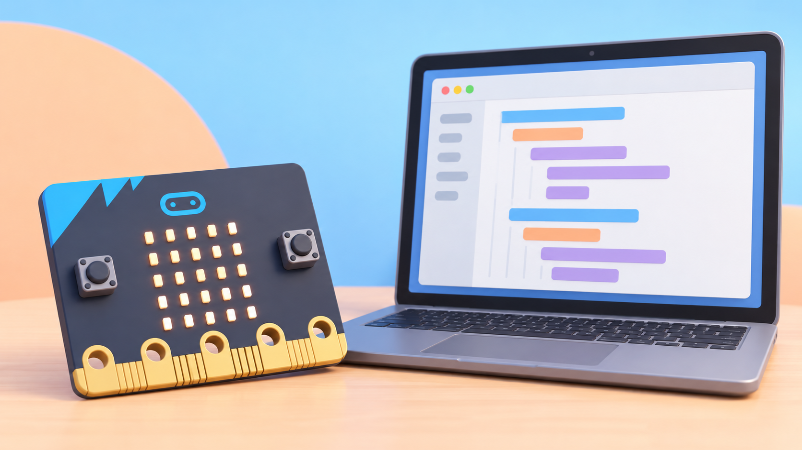

## 🎯 Repte i objectius

Creeu una insígnia que mostre una cara feliç quan es prem A i una cara pensativa quan es prem B. Primer la provareu al simulador i després a la placa. En paral·lel, comparareu la sintaxi MicroPython de l’editor oficial de micro:bit amb el «Python» de Microsoft MakeCode: tots dos serveixen per programar la placa, però no són la mateixa implementació ni comparteixen la mateixa estructura de codi.

- Obrir el Python Editor oficial i localitzar el codi, el simulador, la referència i els avisos d’error.
- Relacionar els botons A/B i la matriu 5 × 5 amb instruccions Python.
- Reconéixer `import`, un bucle `while`, les condicions `if` i la indentació.
- Provar el comportament al simulador abans de transferir el programa.
- Comparar MicroPython i MakeCode Python sense barrejar-ne les biblioteques.

## 🧰 Materials i preparació

- BBC micro:bit V1 o V2 amb cable USB; un portapiles és opcional per a la prova sense ordinador.
- Ordinador amb navegador compatible i accés a [python.microbit.org](https://python.microbit.org/).
- Targetes amb `A`, `B`, `HAPPY` i `CONFUSED` per anticipar la relació entrada–programa–eixida.
- MakeCode o captures impreses per a comparar les dues versions de Python, si convé.

Obriu un projecte nou al Python Editor i llegiu el tutorial de referència integrat. El simulador permet començar sense placa. El V1 i el V2 comparteixen els botons i la matriu necessaris per a aquesta pràctica; no useu micròfon, altaveu ni logotip tàctil, que depenen del V2. Si voleu enviar el codi directament a la placa des del navegador, seguiu la compatibilitat i els passos que l’editor indica; si no, descarregueu el fitxer `.hex` i transferiu-lo per USB.

## 🧩 Funcions del robot treballades

- Python Editor oficial amb MicroPython, simulador, autocompleció, referència i ressaltat d’estructura i errors.
- MicroPython sobre la placa: `button_a`, `button_b` i `display` amb la matriu LED.
- Transferència del programa a la micro:bit o prova prèvia sense maquinari.
- Diferència entre MicroPython i MakeCode Python, que usa funcions d’esdeveniment i una biblioteca pròpia de MakeCode.

## 👣 Seqüència guiada

### 1. Explorem el simulador i el panell de referència

Obriu el Python Editor i localitzeu les pestanyes de referència, idees i API, l’àrea d’edició i el simulador. Trieu una instrucció de pantalla a la referència i arrossegueu-la a l’editor. Executeu un exemple amb el botó de reproducció del simulador i proveu els controls que simulen els botons de la placa.

### 2. Llegiu i prediu el programa

Copieu el programa següent. Abans d’executar-lo, marqueu quines línies es repeteixen i quina eixida correspon a cada botó.

```python
from microbit import *

while True:
    if button_a.is_pressed():
        display.show(Image.HAPPY)
    if button_b.is_pressed():
        display.show(Image.CONFUSED)
```

`from microbit import *` carrega les funcions de la placa; `while True` manté les comprovacions actives; cada `if` prova un botó; `display.show(...)` mostra una icona. Les línies interiors han d’anar indentades. Si premeu A i B alhora, les dues condicions poden executar-se en el mateix cicle: observeu quin dibuix queda visible i expliqueu l’ordre de les instruccions.

### 3. Depureu al Python Editor

Executeu primer el codi al simulador. Canvieu una icona i torneu a provar A i B. Després elimineu temporalment els espais d’una línia interior per veure com el ressaltat o el missatge d’error ajuda a localitzar la indentació incorrecta; desfeu el canvi i comproveu que el programa torna a executar-se. No descarregueu la versió amb error a la placa.



_La placa de la imatge representa la micro:bit de la dotació. La interfície és esquemàtica; l’editor real mostra el text i els avisos de la versió instal·lada._

### 4. Transferiu el programa a una micro:bit

Connecteu la placa per USB i useu l’opció «Send to micro:bit» si el navegador i els permisos són compatibles. Si aquesta opció no apareix, descarregueu el `.hex`, obriu la unitat de la micro:bit i copieu-lo. Espereu que la transferència acabe; després proveu A i B en la placa real i compareu el resultat amb el simulador.

### 5. Compareu amb MakeCode Python

Obriu el mateix repte en l’opció Python de MakeCode. La forma orientada a esdeveniments és diferent:

```python
def on_button_pressed_a():
    basic.show_icon(IconNames.HAPPY)
input.on_button_pressed(Button.A, on_button_pressed_a)
```

MakeCode permet canviar entre blocs, JavaScript i la seua sintaxi Python; el Python Editor oficial de micro:bit usa MicroPython amb `from microbit import *` i un bucle que consulta els botons. No copieu ordres `basic` de MakeCode dins del MicroPython ni funcions `display` de MicroPython dins del projecte MakeCode.

## 🧪 Prova, depura i reflexiona

Feu quatre proves al simulador i a la placa: A, B, cap botó i A+B alhora. Registreu la predicció, l’eixida i les diferències entre simulador i maquinari. Per a depurar, comproveu importació, indentació, nom d’imatge, transferència acabada i editor triat. Canvieu una única cosa cada vegada; si el simulador respon però la placa no, reviseu primer que el fitxer s’ha transferit a la micro:bit correcta.

### Preguntes per comprovar

- Quina part del codi manté el programa escoltant els botons?
- Per què les ordres de cada `if` tenen sagnat?
- Què diferencia l’esdeveniment de MakeCode del bucle de MicroPython?
- Quins errors pot detectar l’editor abans de transferir el fitxer?
- Quines diferències heu observat entre simulador i placa real?


## ♿ Accessibilitat i seguretat

Proporcioneu el codi imprés amb els nivells d’indentació marcats i permeteu arrossegar fragments en lloc d’escriure’ls tots. El simulador és una alternativa per practicar sense dispositiu; una parella pot llegir el codi mentre l’altra prova els botons. Desconnecteu el cable agafant-ne el connector i no pressioneu ni doblegueu la vora daurada de la placa.

## ✅ Evidències d’aprenentatge

Guardeu els dos programes separats i etiquetats com a MicroPython i MakeCode Python, una taula de les quatre proves i una anotació de l’error d’indentació corregit. Indiqueu si l’execució és simulada o s’ha verificat a la placa física i quina versió de micro:bit heu utilitzat.

## 🔗 Fonts oficials i límits

La [guia oficial del Python Editor](https://microbit.org/get-started/user-guide/python-editor/) descriu referència, fragments, ressaltat, errors, autocompleció, simulador i transferència. L’article de la fundació [MakeCode Python i MicroPython](https://support.microbit.org/support/solutions/articles/19000111744-makecode-python-and-micropython) compara les dues sintaxis i els seus models d’execució. L’editor Python necessita haver-se carregat inicialment; després pot funcionar fora de línia en les condicions indicades a la [guia oficial d’ús sense connexió](https://microbit.org/get-started/user-guide/offline/). Les funcions de micròfon, altaveu i logotip tàctil no formen part d’aquesta pràctica i requereixen micro:bit V2.
