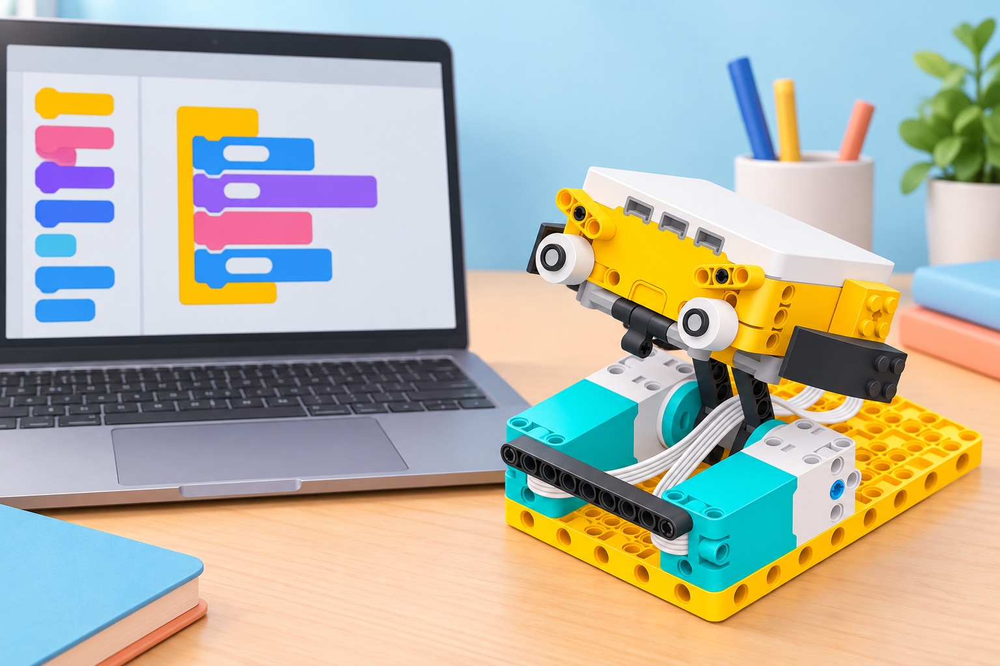

## 🎯 Repte i objectius

Programeu un motor angular del SPIKE Prime amb Python i compareu la seqüència amb la idea que representaríeu amb blocs. La pràctica posa en joc un programa curt i observable perquè l’equip entenga imports, funció principal, port, graus, velocitat i execució asíncrona abans d’afegir sensors o una base mòbil.

En acabar, podreu:

- obrir un projecte de Python a SPIKE App i connectar el Hub Prime;
- associar el motor físic al port declarat al codi;
- interpretar `async`, `await` i la crida `runloop.run(...)` en un exemple curt;
- predir què canvia quan modifiqueu els graus o la velocitat;
- llegir un error de sintaxi o de connexió i corregir-lo amb una prova controlada.

## 🧰 Materials i preparació

- Hub gran LEGO Education SPIKE Prime i SPIKE App en ordinador o tauleta compatible.
- Un motor angular connectat al port A; si useu un altre port, canvieu també la constant al codi.
- Cable USB o Bluetooth BLE i bateria carregada.
- Base de muntatge estable per subjectar el motor o un braç lleuger que puga girar sense atrapar dits.
- Targeta de paper amb les equivalències «port», «angle en graus» i «velocitat».

Obriu un projecte de Python a SPIKE App i connecteu el Hub. Si la interfície no ofereix l’editor Python en el dispositiu o la versió instal·lada, feu el mateix repte amb blocs de paraules i anoteu aquesta diferència; no instal·leu programari alié al flux oficial del centre. Manteniu lliure la zona de gir del motor i no subjecteu l’eix amb els dits mentre s’executa.

## 🧩 Funcions del robot treballades

- Editor de Python de SPIKE App, basat en MicroPython, a més dels blocs d’icones i de paraules.
- Control del motor angular connectat a un port del Hub mitjançant `motor.run_for_degrees`.
- Execució d’una funció asíncrona amb `runloop.run` i `await`.
- Connexió amb el Hub Prime i observació de l’execució o dels missatges d’error de l’app.

## 👣 Seqüència guiada

### 1. Prepareu un motor observable

Connecteu un motor angular al port A i fixeu-lo a una base. Si munteu un braç lleuger, deixeu espai al voltant i una posició inicial marcada. Obriu el projecte Python i comproveu que l’app reconeix el Hub i que el port A apareix disponible.

### 2. Llegiu el codi abans d’executar-lo

Copieu el programa següent. Si el motor està en un altre port, substituïu `port.A` pel port real.

```python
from hub import port
import motor
import runloop

async def main():
    await motor.run_for_degrees(port.A, 360, 400)

runloop.run(main())
```

`port.A` identifica la connexió física; `360` demana una volta de l’eix; `400` és la velocitat indicada pel paràmetre de l’API. `async def main()` agrupa les instruccions principals, `await` espera que acabe el moviment i `runloop.run(main())` inicia el programa. No afegiu `await` fora de la funció asíncrona.

### 3. Predigueu i executeu una volta

Abans de prémer Run, dibuixeu la posició final esperada. Executeu el programa una sola vegada i compareu-la amb la marca inicial. Si l’eix gira en sentit diferent del que volíeu, no forceu el mecanisme: reviseu el sentit, el muntatge i la configuració de la versió de l’API que mostra l’editor.



_La imatge representa el model SPIKE Prime de la dotació; el codi executable és el de l’exemple de dalt._

### 4. Canvieu un paràmetre cada vegada

Canvieu els graus de `360` a `180`, predigueu el nou angle i executeu. Després restaureu `360` i canvieu només la velocitat de `400` a `200`. Registreu si canvia la distància angular, el temps de moviment o tots dos. No canvieu el port i els paràmetres en una mateixa prova.

### 5. Relacioneu Python amb blocs

En un projecte de blocs, representeu la mateixa acció: quan comence el programa, feu girar el motor connectat al port triat durant el nombre de graus i a la velocitat acordada. Compareu quina informació queda explícita en cada format: el bloc agrupa els paràmetres visualment; el text requereix sintaxi, indentació i noms exactes. No cal que les dues interfícies utilitzen exactament el mateix nom intern del bloc.

## 🧪 Prova, depura i reflexiona

Feu tres intents: 360° a velocitat 400, 180° a velocitat 400 i 360° a velocitat 200. Registreu predicció, valor modificat, moviment observat i qualsevol missatge de l’app. Per depurar, comproveu en aquest ordre: motor al port correcte, Hub connectat, `import motor`, `port.A` escrit igual que al programa, indentació del cos de `main`, i crida final a `runloop.run(main())`. Corregiu una sola causa cada vegada.

### Preguntes per comprovar

- Quin element del muntatge correspon a `port.A`?
- Què canvia en passar de 360 a 180 graus? Què canvia en reduir la velocitat?
- Per què les línies del cos de `main()` estan indentades?
- Quina diferència hi ha entre `await` i la crida que inicia el programa?
- Quin error heu trobat i quina prova confirma que la correcció funciona?


## ♿ Accessibilitat i seguretat

Oferiu el programa imprés amb indentació marcada i el mateix moviment representat amb blocs. Es poden assignar rols de lectura de codi, comprovació del port, predicció i registre sense exigir que tothom escriga al teclat. Subjecteu el muntatge, treballeu a baixa velocitat i manteniu mans, cabells i roba fora de l’eix i de les peces mòbils. Atureu l’execució abans de modificar el programa o desconnectar el cable.

## ✅ Evidències d’aprenentatge

Conserveu el programa final, les tres prediccions i observacions, la correspondència entre port del codi i port físic, i una explicació breu d’un error corregit. Si feu captures, retalleu noms d’usuari i qualsevol dada personal; una transcripció del programa i la taula de proves són suficients.

## 🔗 Fonts oficials i límits

La [guia tècnica i FAQ oficial de SPIKE Prime](https://education.lego.com/en-us/teacher-resources/lego-education-spike-prime/support-technical-info/lego-education-spike-prime-support-technical-info-product-info/) confirma sis ports al Hub Prime i que SPIKE App inclou blocs d’icones, blocs de paraules i editor de Python. La lliçó oficial [Get Moving with Motors](https://education.lego.com/en-us/lessons/get-moving-with-motors/) treballa motors amb Python, i l’exemple de [Score!](https://education.lego.com/en-us/lessons/spike-python-u5-playing-games-with-simple-conditions/spike-python-u5l6-score-/) documenta `motor.run_for_degrees`. La sintaxi i les funcions poden variar entre versions: seguiu les indicacions de l’editor instal·lat i no useu biblioteques externes en aquesta activitat.
