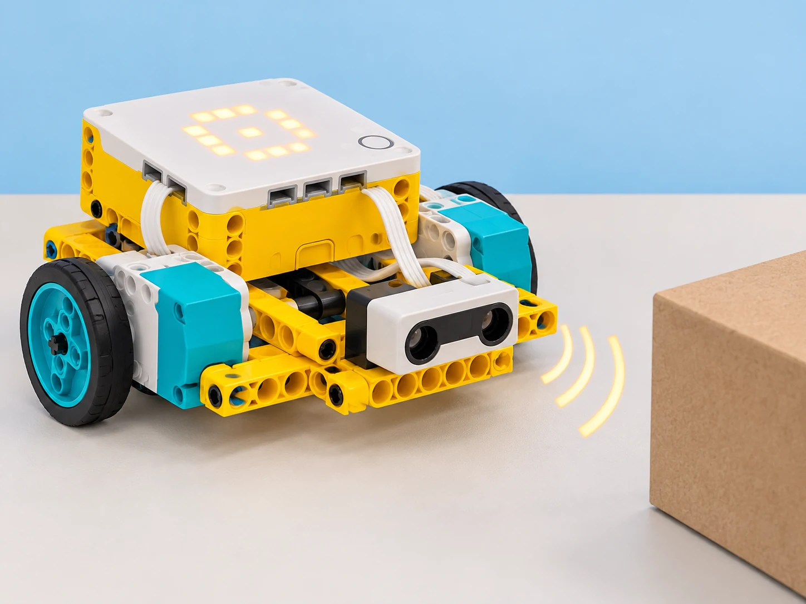

## 🎯 Repte i objectius

Construïu una base mòbil que s’acoste a un obstacle, s’ature mantenint un espai segur i emeta un senyal curt. Compareu la lectura real del sensor d’ultrasons amb la parada calculada per voltes de roda, i feu un gir controlat amb el giroscopi del Hub. La distància de sensor i l’estimació de moviment són mesures diferents.

## 🧰 Materials i preparació

- Hub SPIKE Prime carregat, dos motors angulars i una base de conducció estable.
- Sensor de distància Technic i cables connectats als ports identificats en el programa.
- Paret de blocs o caixa de cartó estable, regle i cinta per marcar línies de prova.
- Espai pla lliure de persones i objectes fràgils.

El sensor oficial usa ultrasons i especifica una lectura de 50–2000 mm amb tolerància de ±20 mm (50–300 mm en lectura ràpida, ±15 mm). L’app pot no exposar totes les funcions descrites a la fitxa tècnica. Verifiqueu quin mode i unitat mostra la versió de SPIKE App disponible.

## 🧩 Funcions del robot treballades

- Sensor de distància ultrasònic per detectar un objecte dins del seu camp de lectura.
- Giroscopi de sis eixos del Hub per mesurar orientació i completar un gir aproximat.
- Altaveu integrat del Hub per emetre un to curt com a eixida.
- Condicionals, aturada de motors i prova dels límits de lectura; el sensor no garanteix una parada de seguretat industrial.

## 👣 Seqüència guiada

### 1. Comproveu el sensor a distàncies conegudes

Fixeu el sensor al davant de la base, perpendicular a una paret plana. Mesureu 5, 10, 20, 30 i 50 cm amb el regle i llegiu el valor al programa sense moure la base. Repetiu cada lectura tres vegades. Anoteu quan apareix el límit inferior o una lectura absent; no suposeu que el rang declarat es manté igual per a objectes tous, inclinats o estrets.

### 2. Programeu una parada amb marge

Feu avançar la base molt lentament i llegiu el sensor en un bucle. Quan la lectura siga igual o inferior a un llindar acordat (per exemple, 120 mm, que és només un punt inicial), atureu els motors. Deixeu sempre un marge addicional i proveu amb l’obstacle a tres distàncies d’inici. No executeu la prova cap a una persona ni cap a objectes fràgils; tingueu l’aturada manual accessible.

### 3. Mesureu un gir amb el giroscopi

Amb la base quieta, poseu el giroscopi a zero segons els blocs de la vostra app. Programeu un gir lent fins a un angle de referència de 90° i compareu l’orientació final amb una plantilla de paper. Repetiu tres vegades a la mateixa velocitat. Si el valor deriva o el gir se’n passa, calibreu el punt inicial i ajusteu una sola variable, com ara velocitat o llindar d’aturada.

### 4. Afegiu un senyal de so

Quan el programa s’ature per distància, feu sonar un to breu amb l’altaveu del Hub i mostreu alhora una icona a la matriu LED. Proveu el comportament amb so activat i amb el volum desconnectat/silenciat si l’app o la configuració ho permeten; manteniu una alternativa visual equivalent. No utilitzeu l’avís com a alarma real de seguretat.

_El sensor mira una paret de cartó estable. La imatge il·lustra el marge de prova; no és una instrucció de muntatge exacte._

## 🧪 Prova, depura i reflexiona

Prepareu una matriu amb distància inicial, distància llegida, llindar, espai final, angle final i senyal observat. Feu tres intents per a cada distància inicial; compareu la lectura d’ultrasons amb una prova per voltes de roda, mantenint velocitat i muntatge tant constants com siga possible. Proveu una caixa ampla i una superfície inclinada només amb el robot quiet per observar com canvia la lectura. Registreu errors i atureu la prova si la lectura no és estable.

### Preguntes per comprovar

- Quina diferència hi ha entre que el sensor detecte l’obstacle i calcular el trajecte amb les voltes de roda?
- En quines condicions la lectura es fa més variable?
- Què heu canviat per millorar l’angle de gir i quina dada ho demostra?
- Quin avís alternatiu veu l’usuari si no vol sentir el so?

## ♿ Accessibilitat i seguretat

Useu velocitat baixa, un obstacle tou i una zona de prova delimitada. Manteniu el botó d’aturada accessible i no confieu en el sensor com a sistema de protecció. Oferiu taula de dades o simulador si una persona prefereix no conduir el robot; el senyal LED ha d’oferir la mateixa informació que el so.

## ✅ Evidències d’aprenentatge

Guardeu el programa, l’esquema dels ports, la taula de lectures repetides i els resultats de distància i angle. En la conclusió, separeu la mesura ultrasònica, l’estimació basada en les rodes i l’aturada per contacte; expliqueu toleràncies i condicions de prova.

## 🔗 Fonts oficials i límits

La fitxa tècnica LEGO del [sensor de distància Technic](https://assets.education.lego.com/v3/assets/blt293eea581807678a/blt64c2b9534cf10f68/5f8801b8bc43790f5c4389ea/techspecs_technicdistancesensor.pdf?locale=en-us) descriu la tecnologia ultrasònica i els rangs; les [especificacions del Hub Prime](https://assets.education.lego.com/v3/assets/blt293eea581807678a/bltf512a371e82f6420/5f8801baf4f4cf0fa39d2feb/techspecs_techniclargehub.pdf?locale=en-us) documenten altaveu i sensor de sis eixos. La lliçó oficial [Going the Distance](https://education.lego.com/en-us/lessons/prime-extra-resources/going-the-distance/) contrasta càlcul per rodes amb aturada per contacte. Les lectures depenen de la superfície i de la versió de l’app; no és un sistema de seguretat certificat.
