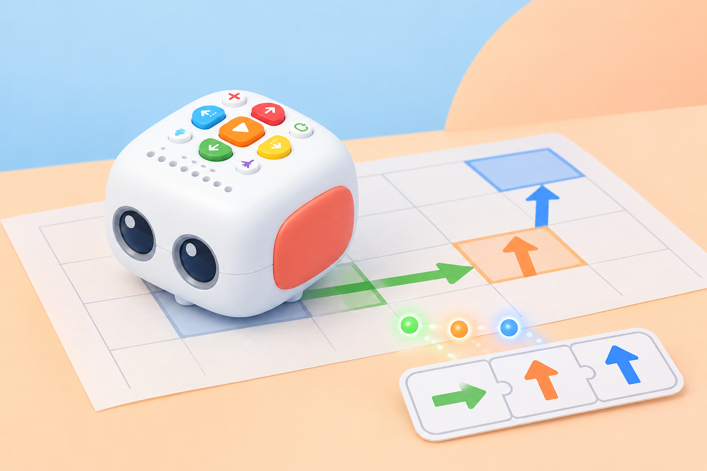

## 🎯 Repte i objectius

Una ruta té una ordre incorrecta. Depureu-la amb el botó Clear de Tale-Bot Pro i compareu els dos usos documentats: una pulsació curta elimina l’última ordre introduïda; una pulsació llarga elimina totes les ordres. En acabar, l’equip podrà observar els indicadors, escollir el tipus d’esborrat adequat i comprovar el programa corregit.

- Llegir la seqüència acumulada als indicadors de color.
- Distingir una pulsació de menys d’un segon d’una pulsació de més d’un segon.
- Corregir l’última ordre sense perdre la resta de la ruta, o esborrar tot el programa quan calga començar de nou.
- Executar només després de revisar el codi que s’ha tornat a introduir.

## 🧰 Materials i preparació

- Tale-Bot Pro carregat i amb una superfície plana per a la prova.
- Targetes de fletxes o una tira de programació en paper.
- Graella o mapa simple amb inici i destinació.
- Full de registre amb tres columnes: seqüència prevista, indicadors observats i recorregut executat.

Trieu una ruta segura de quatre ordres. Abans d’encendre el robot, acordeu quina ordre s’introduirà malament a propòsit i com la detectareu. Identifiqueu el botó Clear/X al model físic. El temps de pulsació és important: feu la demostració primer amb el grup i eviteu pressionar-lo de manera ambigua.

## 🧩 Funcions del robot treballades

- Botó Clear amb esborrat de l’última ordre amb pulsació curta (<1 s).
- Esborrat de totes les ordres introduïdes amb pulsació llarga (>1 s).
- Indicadors de programació que reprodueixen el color de les ordres i s’apaguen quan s’ha buidat la seqüència.
- Depuració d’un programa físic abans d’executar-lo amb Play.

## 👣 Seqüència guiada

### 1. Introduïu una ruta i llegiu-ne els indicadors

Programeu quatre ordres senzilles que facen arribar Tale-Bot a una destinació de la graella. Després de cada pulsació, assenyaleu l’indicador que s’ha encés i actualitzeu la tira de paper. Compareu que hi haja quatre ordres al robot i quatre a la representació. Encara no premeu Play.

### 2. Simuleu un error en l’última ordre

Canvieu la quarta ordre per una ordre incorrecta, anotant-la a la tira com a part de la prova. Feu que una altra parella detecte la diferència entre la ruta prevista i la seqüència que mostren els indicadors. Abans de corregir-la, expliqueu què convé conservar: les tres ordres inicials.

### 3. Retireu només l’última ordre

Premeu Clear breument, menys d’un segon. Comproveu que desapareix l’últim indicador i que els tres anteriors continuen visibles. Introduïu l’ordre correcta i confirmeu que la seqüència torna a tindre quatre passos. Si el resultat no és clar, pareu i reviseu els indicadors abans de continuar.

_La il·lustració mostra el Tale-Bot Pro de la dotació. Les fletxes del mapa són una representació del programa, no una pantalla del robot._

### 4. Executeu la seqüència corregida

Premeu Play una sola vegada i observeu si el recorregut arriba a la destinació. Compareu el moviment amb la tira de paper i els indicadors. Si no coincideix, torneu a planificar i corregiu l’ordre concreta; no buideu el programa complet si només cal retirar l’última instrucció.

### 5. Proveu l’esborrat complet

Introduïu una seqüència nova de tres ordres i manteniu Clear premut més d’un segon. Confirmeu que s’apaguen tots els indicadors. Torneu a introduir una ruta diferent, comproveu-la amb la tira i executeu-la. Compareu quan és més eficient esborrar només l’última ordre i quan convé buidar-ho tot.

## 🧪 Prova, depura i reflexiona

Feu tres comprovacions: una pulsació curta després d’introduir almenys tres ordres; una pulsació llarga amb una seqüència visible; i una reprogramació que s’executa amb Play. Anoteu quins indicadors s’han apagat en cada cas i si les ordres conservades coincideixen amb el pla. Si la pulsació dura aproximadament un segon, repetiu la prova amb una durada clarament curta o llarga, sense afegir més ordres al mateix temps.

### Preguntes per comprovar

- Què s’esborra amb una pulsació curta i què s’esborra amb una de llarga?
- Com sabem pels indicadors quantes ordres queden programades?
- Per què cal revisar els indicadors abans de prémer Play?
- En quin cas és millor corregir només l’última ordre? Quan començaríeu de nou?
- Quina diferència hi ha entre esborrar una ordre i reiniciar el robot?

## ♿ Accessibilitat i seguretat

Useu una tira de fletxes gran, pictogrames o ordres dites en veu alta per anticipar la seqüència. El temps es pot comptar amb «curt» i «mantín» abans de provar-lo amb el criteri inferior o superior a un segon. Repartiu els rols de programació, observació dels indicadors i registre. Manteniu el robot quiet durant la correcció i no pressioneu diverses tecles alhora.

## ✅ Evidències d’aprenentatge

Conserveu la tira de la seqüència inicial i la corregida, una taula que compare Clear curt i llarg, i el resultat de l’execució final. L’evidència ha de mostrar que l’equip ha conservat les ordres útils en la correcció parcial i ha confirmat l’apagat dels indicadors en l’esborrat complet. No cal gravar veus ni fotografiar l’alumnat.

## 🔗 Fonts oficials i límits

El [curs oficial de Tale-Bot Pro de Matatalab](https://matatalab.com/en/lesson4.2) especifica que Clear premut menys d’un segon elimina l’última ordre i mantingut més d’un segon esborra totes les ordres; també indica que els indicadors de programació s’apaguen quan la seqüència és buida. Els llindars són els publicats pel fabricant: en la pràctica, feu una pulsació clarament inferior o superior a un segon i comproveu el resultat en el vostre robot.
