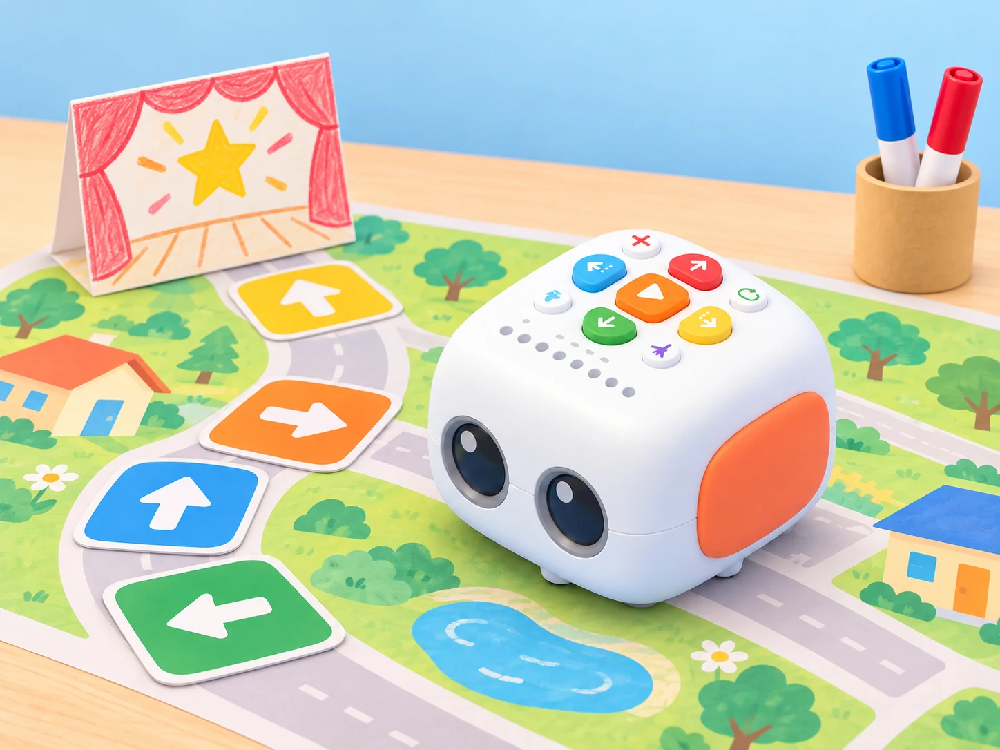

## 🎯 Repte i objectius

Prepareu una ruta narrativa curta amb una part repetida, una dansa final i un mapa interactiu. L’objectiu és identificar quines ordres executa el robot, quina informació ofereix la superfície OID i com es pot esborrar o corregir un programa. Aquesta guia requereix Tale-Bot Pro; confirmeu que el mapa i els accessoris de la dotació són compatibles.

## 🧰 Materials i preparació

- Tale-Bot Pro carregat, en una superfície plana.
- Un mapa interactiu OID compatible o, com a alternativa, un mapa imprés sense funcions interactives.
- Targetes de comandament i una ruta curta amb inici i destinació marcats.
- Dos retoladors rentables i el suport de dibuix només si formen part del kit del centre.

Abans de començar, comproveu les tecles físiques de moviment, Play, esborrat, repetició, dansa i gravació. El fabricant documenta una gravació de veu de fins a 30 segons i sis danses predefinides; les funcions interactives del mapa depenen del mapa concret.

## 🧩 Funcions del robot treballades

- Botó de repetició per repetir unitats d’ordres del programa complet; no permet repetir només un fragment d’un programa més llarg.
- Indicadors de color per seguir les ordres enregistrades.
- Botó de dansa aleatòria amb moviments predefinits.
- Lectura OID del mapa compatible i instruccions de veu contextuals.
- Gravació i reproducció d’àudio, diferenciades de la interpretació de parla.
- Dibuix mitjançant accessori compatible, com a extensió opcional.

## 👣 Seqüència guiada

### 1. Programeu i repetiu una seqüència

Trieu un patró curt que es repetisca, com ara avançar i girar, i escriviu-lo primer amb targetes. Introduïu-lo amb els botons, comproveu els indicadors i useu el comandament de repetició per repetir el programa. El fabricant especifica que la repetició s’aplica quan el programa complet conté unitats d’ordres repetides: no permet seleccionar només un fragment si després hi ha altres ordres. Feu una prova amb un patró repetit com a programa complet i una altra afegint-hi una ordre final; observeu i registreu aquesta limitació abans de dissenyar la ruta.

### 2. Compareu la dansa predefinida

Activeu el botó de dansa aleatòria tres vegades i anoteu si el moviment canvia entre intents. Compareu-lo amb una seqüència direccional pròpia: la dansa selecciona un patró incorporat, mentre que la ruta depén de les ordres introduïdes. No presenteu els moviments de dansa com una seqüència que l’alumnat haja programat.

### 3. Exploreu la guia d’un mapa OID

Amb un mapa compatible, col·loqueu primer el robot a l’entrada principal indicada pel fabricant i escolteu la instrucció. Després poseu-lo en una entrada secundària i escolteu com canvia el repte. Programeu una ruta per arribar a una destinació i feu servir Play per iniciar-la. Si només disposeu d’un mapa imprés, simuleu les instruccions amb una targeta docent i identifiqueu clarament que la lectura OID no s’està executant.

### 4. Afegiu una veu gravada o un traç opcional

Graveu una frase fictícia curta amb el botó de gravació, escolteu-la per comprovar-la i inseriu-la a la seqüència perquè es reproduïsca en arribar a una parada. No demaneu dades identificatives ni feu servir la veu d’un infant sense els acords del centre. Si el suport de retoladors és al kit, afegiu-lo i proveu una ruta geomètrica senzilla sobre paper fix; no forceu el suport ni atribuïu el traç al mapa OID.

_La il·lustració representa una activitat amb mapa i targetes; la lectura OID només funciona amb un mapa compatible del conjunt._

## 🧪 Prova, depura i reflexiona

Feu tres execucions de la ruta: sense repetició, amb repetició i amb una ordre esborrada abans de Play. Registreu la seqüència prevista, la que indiquen els llums, l’ordre observat i el resultat. Proveu també la dansa tres vegades, una entrada principal i una de secundària del mapa, i una gravació seguida de reproducció. Si una instrucció de veu del mapa no s’interromp com espereu, espereu que acabe o useu Play segons el manual; no premeu ordres aleatòries mentre sona.

### Preguntes per comprovar

- Què passa quan el programa complet és el patró repetit? I quan hi afegim una ordre final?
- Per què no podem demanar al botó que repetisca només un fragment intermedi?
- La dansa és programada amb les targetes o és un moviment predefinit?
- Quina diferència hi ha entre la veu gravada per l’usuari i la instrucció OID del mapa?
- El mapa imprés i el mapa OID ofereixen exactament la mateixa funció?

## ♿ Accessibilitat i seguretat

Oferiu la ruta en format visual, oral o tàctil i permeteu treballar amb mapes impresos quan el mapa interactiu no estiga disponible. Manteniu mans i retoladors lluny de les rodes i esborreu el programa abans de moure el robot. La gravació és opcional i es pot substituir per un missatge de l’adult o una targeta; no publiqueu noms ni veus identificables.

## ✅ Evidències d’aprenentatge

Recolliu el mapa de ruta, la seqüència de targetes, el registre de les tres execucions i una explicació que distingisca repetició, dansa predefinida, gravació i lectura OID. Identifiqueu quin accessori s’ha utilitzat i quines funcions no estaven disponibles al vostre kit.

## 🔗 Fonts oficials i límits

El [curs oficial de Tale-Bot Pro de Matatalab](https://matatalab.com/en/lesson4.2) descriu botons, indicadors, gravació/reproducció, dansa i repetició. Les [instruccions oficials de l’Activity Box](https://matatalab.com/en/lesson4.3) documenten l’ús dels mapes interactius i les entrades OID. La gravació no és reconeixement de parla; la dansa no és una seqüència creada per l’usuari; la repetició no permet seleccionar una subseqüència dins d’un programa més llarg; i la lectura de mapa requereix material OID compatible.
